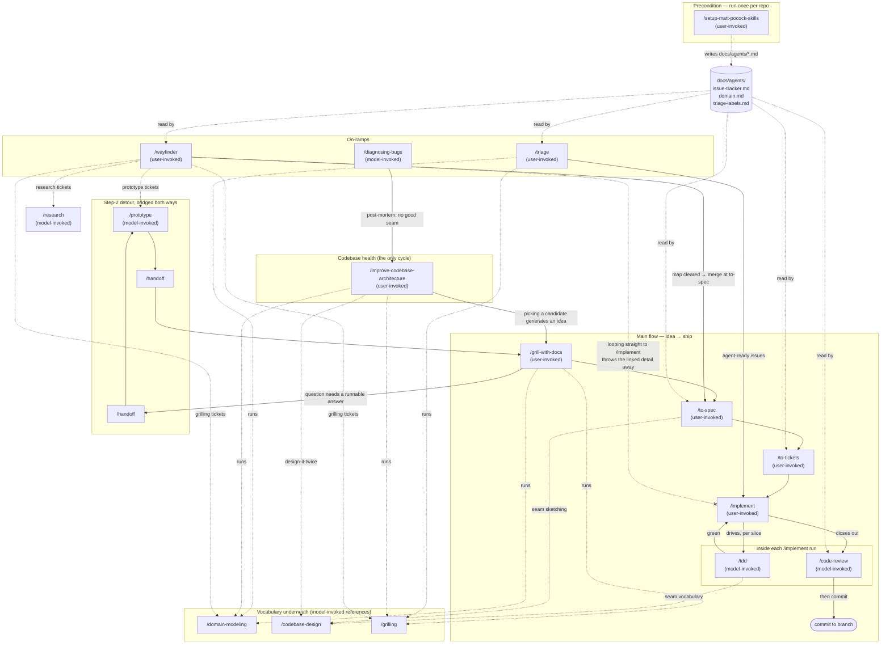

# Skills Corpus — Matt Pocock's `mattpocock/skills`

An exhaustive harvest of the software-engineering concepts encoded in Matt Pocock's agent-skills
repository. Every claim carries a `path:line` citation into the live repo. Quotes are verbatim.

## Provenance

| Fact | Value | Citation |
| --- | --- | --- |
| Upstream repo | `https://github.com/mattpocock/skills` | `package.json:7` (`repository.url`), `.claude-plugin/plugin.json:6` |
| Package name | `mattpocock-skills` | `package.json:2` |
| `package.json` version | `1.1.0` | `package.json:3` |
| `.claude-plugin/plugin.json` version | `1.2.0` (ahead — release pending) | `.claude-plugin/plugin.json:3` |
| Author / homepage | Matt Pocock, `https://www.aihero.dev` | `.claude-plugin/plugin.json:5-7` |
| Marketplace | repo is its own single-plugin marketplace | `.claude-plugin/marketplace.json:2-16`, `CLAUDE.md:12` |
| Published docs URL pattern | `https://aihero.dev/skills-<skill-name>` | `CLAUDE.md:18`, `.agents/writing-docs.md:3` |
| Local snapshot HEAD | `2ab9580 Merge pull request #681 from mattpocock/docs/install-instructions-split` | `git log` |

> The published URL is `https://aihero.dev/skills-<skill-name>` regardless of bucket — the docs path is repo organisation only.
> — `CLAUDE.md:18`

Read scope: all 17 promoted `skills/engineering/*` skills + supporting files, all 5
`skills/productivity/*` skills + supporting files, all 22 `docs/{engineering,productivity}/*.md`
pages, `.agents/**`, root `CLAUDE.md` / `CONTEXT.md` / `README.md` / `CHANGELOG.md`,
`.changeset/*`, `.out-of-scope/*`, and skim of `skills/{in-progress,misc,deprecated,personal}/`.

---

# A. Term ledger

Terms are grouped by the skill that owns them (the repo's own "single source of truth" discipline
means each term has exactly one authoritative home). `_Avoid_` lists are the repo's own explicit
rejections.

## A.1 — Deep-module vocabulary (owner: `codebase-design`)

`skills/engineering/codebase-design/SKILL.md` is declared the sole owner of these words:

> Use these terms exactly — don't substitute "component," "service," "API," or "boundary." Consistent language is the whole point.
> — `skills/engineering/codebase-design/SKILL.md:12`

### Module

> **Module** — anything with an interface and an implementation. Deliberately scale-agnostic: a function, class, package, or tier-spanning slice. _Avoid_: unit, component, service.
> — `skills/engineering/codebase-design/SKILL.md:14`

- **Avoided**: unit, component, service. Also "layer, wrapper (for module, when you mean module)" — `skills/engineering/improve-codebase-architecture/HTML-REPORT.md:112`
- **Used by**: `codebase-design`, `improve-codebase-architecture` (`skills/engineering/improve-codebase-architecture/SKILL.md:13`), `tdd`, `to-spec` (`skills/engineering/to-spec/SKILL.md:47-48`)

### Interface

> **Interface** — everything a caller must know to use the module correctly: the type signature, but also invariants, ordering constraints, error modes, required configuration, and performance characteristics. _Avoid_: API, signature (too narrow — they refer only to the type-level surface).
> — `skills/engineering/codebase-design/SKILL.md:16`

- **Relationship**: "A **Module** has exactly one **Interface** (the surface it presents to callers and tests)." — `skills/engineering/codebase-design/SKILL.md:99`
- **Rejected framing**: "**\"Interface\" as the TypeScript `interface` keyword or a class's public methods**: too narrow — interface here includes every fact a caller must know." — `skills/engineering/codebase-design/SKILL.md:108`

### Implementation

> **Implementation** — what's inside a module, its body of code. Distinct from **Adapter**: a thing can be a small adapter with a large implementation (a Postgres repo) or a large adapter with a small implementation (an in-memory fake). Reach for "adapter" when the seam is the topic; "implementation" otherwise.
> — `skills/engineering/codebase-design/SKILL.md:18`

### Depth / Deep module / Shallow module

> **Depth** — leverage at the interface: the amount of behaviour a caller (or test) can exercise per unit of interface they have to learn. A module is **deep** when a large amount of behaviour sits behind a small interface, **shallow** when the interface is nearly as complex as the implementation.
> — `skills/engineering/codebase-design/SKILL.md:20`

- ASCII diagrams of deep vs shallow: `skills/engineering/codebase-design/SKILL.md:32-52`
- **Principle**: "**Depth is a property of the interface, not the implementation.**" — `skills/engineering/codebase-design/SKILL.md:62`
- **Rejected framing (explicitly names Ousterhout)**: "**Depth as ratio of implementation-lines to interface-lines** (Ousterhout): rewards padding the implementation. We use depth-as-leverage instead." — `skills/engineering/codebase-design/SKILL.md:107`
- Ousterhout is nonetheless quoted approvingly in the README: "The best modules are deep. They allow a lot of functionality to be accessed through a simple interface." — `README.md:166-168`

### Seam _(attributed: Michael Feathers)_

> **Seam** _(Michael Feathers)_ — a place where you can alter behaviour without editing in that place; the *location* at which a module's interface lives. Where to put the seam is its own design decision, distinct from what goes behind it. _Avoid_: boundary (overloaded with DDD's bounded context).
> — `skills/engineering/codebase-design/SKILL.md:22`

A second, test-side definition lives in `tdd`:

> A **seam** is the public boundary you test at: the interface where you observe behavior without reaching inside. Tests live at seams, never against internals.
> — `skills/engineering/tdd/SKILL.md:20`

- **Rejected framing**: "**\"Boundary\"**: overloaded with DDD's bounded context. Say **seam** or **interface**." — `skills/engineering/codebase-design/SKILL.md:109`
- **Used by**: `tdd`, `to-spec` (`skills/engineering/to-spec/SKILL.md:15`), `implement` (`skills/engineering/implement/SKILL.md:9`), `diagnosing-bugs` (`skills/engineering/diagnosing-bugs/SKILL.md:110-114`), `improve-codebase-architecture`, `wayfinder` (indirectly)

### Internal seam vs external seam

> A module can have **internal seams** (private to its implementation, used by its own tests) as well as the **external seam** at its interface.
> — `skills/engineering/codebase-design/SKILL.md:62`

> **Internal seams vs external seams.** A deep module can have internal seams (private to its implementation, used by its own tests) as well as the external seam at its interface. Don't expose internal seams through the interface just because tests use them.
> — `skills/engineering/codebase-design/DEEPENING.md:30`

### Adapter

> **Adapter** — a concrete thing that satisfies an interface at a seam. Describes *role* (what slot it fills), not substance (what's inside).
> — `skills/engineering/codebase-design/SKILL.md:24`

### Port

> Define a **port** (interface) at the seam. The deep module owns the logic; the transport is injected as an **adapter**. Tests use an in-memory adapter. Production uses an HTTP/gRPC/queue adapter.
> — `skills/engineering/codebase-design/DEEPENING.md:19`

### Leverage

> **Leverage** — what callers get from depth: more capability per unit of interface they learn. One implementation pays back across N call sites and M tests.
> — `skills/engineering/codebase-design/SKILL.md:26`

### Locality

> **Locality** — what maintainers get from depth: change, bugs, knowledge, and verification concentrate in one place rather than spreading across callers. Fix once, fixed everywhere.
> — `skills/engineering/codebase-design/SKILL.md:28`

### The deletion test

> **The deletion test.** Imagine deleting the module. If complexity vanishes, it was a pass-through. If complexity reappears across N callers, it was earning its keep.
> — `skills/engineering/codebase-design/SKILL.md:63`

- Applied operationally in `skills/engineering/improve-codebase-architecture/SKILL.md:35`: "Apply the **deletion test** to anything you suspect is shallow: would deleting it concentrate complexity, or just move it? A \"yes, concentrates\" is the signal you want."

### The interface is the test surface

> **The interface is the test surface.** Callers and tests cross the same seam. If you want to test *past* the interface, the module is probably the wrong shape.
> — `skills/engineering/codebase-design/SKILL.md:64`

### One adapter / two adapters (seam justification rule)

> **One adapter means a hypothetical seam. Two adapters means a real one.** Don't introduce a seam unless something actually varies across it.
> — `skills/engineering/codebase-design/SKILL.md:65`

> Don't introduce a port unless at least two adapters are justified (typically production + test). A single-adapter seam is just indirection.
> — `skills/engineering/codebase-design/DEEPENING.md:29`

### Dependency categories (four)
`skills/engineering/codebase-design/DEEPENING.md:5-25` classifies dependencies to decide how a
deepened module is tested across its seam:

1. **In-process** — "Pure computation, in-memory state, no I/O. Always deepenable" (`skills/engineering/codebase-design/DEEPENING.md:11`)
2. **Local-substitutable** — "Dependencies that have local test stand-ins (PGLite for Postgres, in-memory filesystem) […] The seam is internal; no port at the module's external interface." (`skills/engineering/codebase-design/DEEPENING.md:15`)
3. **Remote but owned (Ports & Adapters)** — `skills/engineering/codebase-design/DEEPENING.md:17-21`
4. **True external (Mock)** — "Third-party services (Stripe, Twilio, etc.) you don't control." (`skills/engineering/codebase-design/DEEPENING.md:25`)

These four names reappear as report badges: `in-process`, `local-substitutable`, `ports & adapters`, `mock` — `skills/engineering/improve-codebase-architecture/HTML-REPORT.md:47`

### Replace, don't layer

> - Old unit tests on shallow modules become waste once tests at the deepened module's interface exist — delete them.
> - Write new tests at the deepened module's interface. The **interface is the test surface**.
> — `skills/engineering/codebase-design/DEEPENING.md:34-35`

> Tests should survive internal refactors — they describe behaviour, not implementation. If a test has to change when the implementation changes, it's testing past the interface.
> — `skills/engineering/codebase-design/DEEPENING.md:37`

### Design It Twice _(attributed: Ousterhout)_

> Based on "Design It Twice" (Ousterhout) — your first idea is unlikely to be the best.
> — `skills/engineering/codebase-design/DESIGN-IT-TWICE.md:3`

Mechanic: 3+ parallel sub-agents, each given a different design constraint
(`skills/engineering/codebase-design/DESIGN-IT-TWICE.md:24-28`), compared on "**depth** (leverage at the interface), **locality**
(where change concentrates), and **seam placement**" (`skills/engineering/codebase-design/DESIGN-IT-TWICE.md:42`).

### Deepening opportunity

> Surface architectural friction and propose **deepening opportunities** — refactors that turn shallow modules into deep ones. The aim is testability and AI-navigability.
> — `skills/engineering/improve-codebase-architecture/SKILL.md:9`

### Rejected framings (the section itself)
`skills/engineering/codebase-design/SKILL.md:105-109` — a literal `## Rejected framings` heading
listing three rejections (depth-as-ratio/Ousterhout, TS-`interface`-keyword, "boundary").

---

## A.2 — Test vocabulary (owner: `tdd`)

### Red-green (the loop) — note the retired "refactor"

> TDD is the red → green loop.
> — `skills/engineering/tdd/SKILL.md:8`

> **Refactoring is not part of the loop.** It belongs to the review stage (see the `code-review` skill), not the red → green implementation cycle.
> — `skills/engineering/tdd/SKILL.md:36`

The full phrase "red-green-refactor" survives only as an **invocation trigger**, not as the loop:

> description: Test-driven development. Use when the user wants to build features or fix bugs test-first, mentions "red-green-refactor", or wants integration tests.
> — `skills/engineering/tdd/SKILL.md:3`

History confirms this was deliberate: "Also dropped the refactor stage — TDD is now red → green;
refactoring belongs to the review stage, so the refactor rule and `refactoring.md` moved out (its
home is `code-review`)." — `CHANGELOG.md:55`

### Red before green

> **Red before green.** Write the failing test first, then only enough code to pass it. Don't anticipate future tests or add speculative features.
> — `skills/engineering/tdd/SKILL.md:34`

### Pre-agreed seams

> **Test only at pre-agreed seams.** Before writing any test, write down the seams under test and confirm them with the user. No test is written at an unconfirmed seam. You can't test everything — agreeing the seams up front is how testing effort lands on the critical paths and complex logic instead of every edge case.
> — `skills/engineering/tdd/SKILL.md:22`

- Consumed by `implement`: "Use /tdd where possible, at pre-agreed seams." — `skills/engineering/implement/SKILL.md:9`
- And by `to-spec`, which is where the seams are agreed: `skills/engineering/to-spec/SKILL.md:15-17`

### Implementation-coupled tests _(anti-pattern)_

> **Implementation-coupled** — mocks internal collaborators, tests private methods, or verifies through a side channel (querying the database instead of using the interface). The tell: the test breaks when you refactor but behavior hasn't changed.
> — `skills/engineering/tdd/SKILL.md:28`

Worked BAD/GOOD example pair: `skills/engineering/tdd/tests.md:29-60`.

### Tautological tests _(anti-pattern)_

> **Tautological** — the assertion recomputes the expected value the way the code does (`expect(add(a, b)).toBe(a + b)`, a snapshot derived by hand the same way, a constant asserted equal to itself), so it passes by construction and can never disagree with the code. Expected values must come from an independent source of truth — a known-good literal, a worked example, the spec.
> — `skills/engineering/tdd/SKILL.md:29`

Worked example: `skills/engineering/tdd/tests.md:63-77`.

### Horizontal slicing _(anti-pattern)_ / Vertical slice / Tracer bullet

> **Horizontal slicing** — writing all tests first, then all implementation. Bulk tests verify _imagined_ behavior: you test the _shape_ of things rather than user-facing behavior, the tests go insensitive to real changes, and you commit to test structure before understanding the implementation. Work in **vertical slices** instead — one test → one implementation → repeat, each test a **tracer bullet** that responds to what the last cycle taught you.
> — `skills/engineering/tdd/SKILL.md:30`

The published doc gives the sharpest horizontal/vertical contrast:

> A **horizontal** slice ships one layer of the change — all the schema, or all the API — and nothing works until every layer lands. A **vertical** slice, the tracer bullet, ships one narrow path through *every* layer at once, so it can be demoed the moment it's done.
> — `docs/engineering/to-tickets.md:40`

### One slice at a time

> **One slice at a time.** One seam, one test, one minimal implementation per cycle.
> — `skills/engineering/tdd/SKILL.md:35`

### Mocking policy

> Mock at **system boundaries** only:
> — `skills/engineering/tdd/mocking.md:3`

Mock: external APIs, databases (sometimes — prefer test DB), time/randomness, filesystem
(sometimes) — `skills/engineering/tdd/mocking.md:5-8`. Don't mock: "Your own classes/modules / Internal collaborators
/ Anything you control" — `skills/engineering/tdd/mocking.md:11-13`.

Two design rules for mockability: **dependency injection** (`skills/engineering/tdd/mocking.md:20-35`) and **prefer
SDK-style interfaces over generic fetchers** (`skills/engineering/tdd/mocking.md:37-53`).

### What a good test is

> Tests verify behavior through public interfaces, not implementation details. Code can change entirely; tests shouldn't. A good test reads like a specification — "user can checkout with valid cart" tells you exactly what capability exists — and survives refactors because it doesn't care about internal structure.
> — `skills/engineering/tdd/SKILL.md:14`

Characteristics of good tests (`skills/engineering/tdd/tests.md:19-23`); red flags for bad ones (`skills/engineering/tdd/tests.md:40-45`).

---

## A.3 — Domain vocabulary (owner: `domain-modeling`)

### Domain model — active vs passive

> Actively build and sharpen the project's domain model as you design. This is the *active* discipline — challenging terms, inventing edge-case scenarios, and writing the glossary and decisions down the moment they crystallise. (Merely *reading* `CONTEXT.md` for vocabulary is not this skill — that's a one-line habit any skill can do. This skill is for when you're changing the model, not just consuming it.)
> — `skills/engineering/domain-modeling/SKILL.md:8`

Reinforced as a repo-wide rule:

> Merely _reading_ `CONTEXT.md` for vocabulary is a one-line prose pointer, not the `domain-modeling` skill. Only the active build/sharpen discipline (challenge terms, edge-case scenarios, write ADRs, update `CONTEXT.md` inline) is `domain-modeling`.
> — `.agents/invocation.md:20`

### `CONTEXT.md`

> `CONTEXT.md` should be totally devoid of implementation details. Do not treat `CONTEXT.md` as a spec, a scratch pad, or a repository for implementation decisions. It is a glossary and nothing else.
> — `skills/engineering/domain-modeling/SKILL.md:64`

Format rules (`skills/engineering/domain-modeling/CONTEXT-FORMAT.md:27-30`):
- "**Be opinionated.** When multiple words exist for the same concept, pick the best one and list the others under `_Avoid_`." (`:27`)
- "**Keep definitions tight.** One or two sentences max. Define what it IS, not what it does." (`:28`)
- "**Only include terms specific to this project's context.** General programming concepts (timeouts, error types, utility patterns) don't belong even if the project uses them extensively." (`:29`)

Created lazily: "Create files lazily — only when you have something to write." — `skills/engineering/domain-modeling/SKILL.md:40`

### `CONTEXT-MAP.md` (multi-context repos)

> If a `CONTEXT-MAP.md` exists at the root, the repo has multiple contexts. The map points to where each one lives
> — `skills/engineering/domain-modeling/SKILL.md:24`

Template with `## Contexts` and `## Relationships` sections: `skills/engineering/domain-modeling/CONTEXT-FORMAT.md:38-52`.

### ADR (Architecture Decision Record)

> ADRs live in `docs/adr/` and use sequential numbering: `0001-slug.md`, `0002-slug.md`, etc.
> — `skills/engineering/domain-modeling/ADR-FORMAT.md:3`

> That's it. An ADR can be a single paragraph. The value is in recording *that* a decision was made and *why* — not in filling out sections.
> — `skills/engineering/domain-modeling/ADR-FORMAT.md:15`

**The three-test gate** (all three must hold, stated twice — `skills/engineering/domain-modeling/SKILL.md:68-72` and
`skills/engineering/domain-modeling/ADR-FORMAT.md:31-35`):

> 1. **Hard to reverse** — the cost of changing your mind later is meaningful
> 2. **Surprising without context** — a future reader will wonder "why did they do it this way?"
> 3. **The result of a real trade-off** — there were genuine alternatives and you picked one for specific reasons
> — `skills/engineering/domain-modeling/SKILL.md:70-72`

What qualifies (`skills/engineering/domain-modeling/ADR-FORMAT.md:39-47`): architectural shape, integration patterns between contexts,
technology choices carrying lock-in, boundary and scope decisions, deliberate deviations from the
obvious path, constraints not visible in the code, rejected alternatives when the rejection is
non-obvious.

### Domain-session techniques
Five named moves in `skills/engineering/domain-modeling/SKILL.md:44-62`: **Challenge against the glossary** (`:44`),
**Sharpen fuzzy language** (`:48`), **Discuss concrete scenarios** (`:52`), **Cross-reference with
code** (`:56`), **Update CONTEXT.md inline** (`:60`).

### Ubiquitous language `[used-but-undefined-in-repo]`
The term appears in `skills/engineering/domain-modeling/SKILL.md:3` (description),
`docs/engineering/domain-modeling.md:15` and `:40`, and in the README's Eric Evans epigraph
(`README.md:107-109`) — but no file in the repo supplies a definition of it. The deprecated
`ubiquitous-language` skill (`skills/deprecated/ubiquitous-language/SKILL.md:3`) also only names it.
The repo supplies `CONTEXT.md`-as-glossary and `domain-modeling` in its place.

### Bounded context `[used-but-undefined-in-repo]`
Appears only as a collision to avoid: `skills/engineering/codebase-design/SKILL.md:22` and `:109`
("overloaded with DDD's bounded context"). Never defined.

### Context map (as a DDD concept) `[used-but-undefined-in-repo]`
The **file** `CONTEXT-MAP.md` is fully specified (`skills/engineering/domain-modeling/CONTEXT-FORMAT.md:36-52`), but
"context map" as a DDD term is never defined. The repo describes the file's job, not the concept.

---

## A.4 — The repo's own domain terms (owner: root `CONTEXT.md`)

The repository dogfoods `domain-modeling` on itself. Its own glossary:

### Issue tracker

> The tool that hosts a repo's issues — GitHub Issues, Linear, a local `.scratch/` markdown convention, or similar. Skills like `to-tickets`, `to-spec`, `triage`, and `qa` read from and write to it.
> _Avoid_: backlog manager, backlog backend, issue host
> — `CONTEXT.md:8-9`

### Issue

> A single tracked unit of work inside an **Issue tracker** — a bug, task, spec, or slice produced by `to-tickets`.
> _Avoid_: ticket (use only when quoting external systems that call them tickets, or for a **Decision ticket** — see below)
> — `CONTEXT.md:12-13`

### Decision ticket

> A `wayfinder` unit — a child **Issue** of a `wayfinder:map` holding a *question* whose resolution is a decision, not a slice of a build to execute. The **decision** qualifier is what keeps it distinct from an implementation ticket; `wayfinder` introduces the term, then uses "ticket".
> — `CONTEXT.md:16`

Origin of the term is documented: `.changeset/wayfinder-decision-tickets.md:5-7` — "People kept
reading a wayfinder ticket as an ordinary *implementation* ticket […] `CONTEXT.md` records **Decision
ticket** as a domain term so the \"avoid: ticket\" guidance no longer contradicts wayfinder's
deliberate use of the word."

### Triage role

> A canonical state-machine label applied to an **Issue** during triage (e.g. `needs-triage`, `ready-for-afk`). Each role maps to a real label string in the **Issue tracker** via `docs/agents/triage-labels.md`.
> — `CONTEXT.md:19`

### Flagged ambiguities (the repo's own resolved collisions)

> - "backlog" was previously used to mean both the *tool* hosting issues and the *body of work* inside it — resolved: the tool is the **Issue tracker**; "backlog" is no longer used as a domain term.
> - "backlog backend" / "backlog manager" — resolved: collapsed into **Issue tracker**.
> — `CONTEXT.md:29-30`

---

## A.5 — Planning vocabulary (owners: `to-spec`, `to-tickets`)

### Spec (a.k.a. PRD)

> This skill takes the current conversation context and codebase understanding and produces a spec (you may know this document as a PRD). Do NOT interview the user — just synthesize what you already know.
> — `skills/engineering/to-spec/SKILL.md:7`

Template sections (`skills/engineering/to-spec/SKILL.md:21-75`): Problem Statement, Solution, User Stories,
Implementation Decisions, Testing Decisions, Out of Scope, Further Notes.

Durability rule: "Do NOT include specific file paths or code snippets. They may end up being
outdated very quickly." — `skills/engineering/to-spec/SKILL.md:55`

### Highest seam / fewest seams

> Sketch out the seams at which you're going to test the feature. Existing seams should be preferred to new ones. Use the highest seam possible. If new seams are needed, propose them at the highest point you can. The fewer seams across the codebase, the better - the ideal number is one.
> — `skills/engineering/to-spec/SKILL.md:15`

### Ticket / tracer-bullet ticket

> Break a plan, spec, or conversation into a set of **tickets** — tracer-bullet vertical slices, each declaring the tickets that **block** it.
> — `skills/engineering/to-tickets/SKILL.md:9`

Vertical-slice rules (`skills/engineering/to-tickets/SKILL.md:29-36`):
> - Each slice cuts a narrow but COMPLETE path through every layer (schema, API, UI, tests) — vertical, NOT a horizontal slice of one layer
> - A completed slice is demoable or verifiable on its own
> - Each slice is sized to fit in a single fresh context window
> - Any prefactoring should be done first
> — `skills/engineering/to-tickets/SKILL.md:31-34`

### Blocking edges

> Give each ticket its **blocking edges** — the other tickets that must complete before it can start. A ticket with no blockers can start immediately.
> — `skills/engineering/to-tickets/SKILL.md:38`

### Frontier (ticket sense)

> Work the **frontier**: any ticket whose blockers are all done. For a purely linear chain that means top to bottom.
> — `skills/engineering/to-tickets/SKILL.md:65`

### Prefactor

> Look for opportunities to prefactor the code to make the implementation easier. "Make the change easy, then make the easy change."
> — `skills/engineering/to-tickets/SKILL.md:23`

### Wide refactor / Blast radius / Expand–contract

> **Wide refactors are the exception to vertical slicing.** A **wide refactor** is one mechanical change — rename a column, retype a shared symbol — whose **blast radius** fans across the whole codebase, so a single edit breaks thousands of call sites at once and no vertical slice can land green. Don't force it into a tracer bullet; sequence it as **expand–contract**. First expand: add the new form beside the old so nothing breaks. Then migrate the call sites over in batches sized by blast radius (per package, per directory), each batch its own ticket blocked by the expand, keeping CI green batch to batch because the old form still exists. Finally contract: delete the old form once no caller remains, in a ticket blocked by every migrate batch. When even the batches can't stay green alone, keep the sequence but let them share an integration branch that all block a final integrate-and-verify ticket — green is promised only there.
> — `skills/engineering/to-tickets/SKILL.md:40`

---

## A.6 — Triage vocabulary (owner: `triage`)

### Category roles (2) and State roles (5)

> Two **category** roles:
> - `bug` — something is broken
> - `enhancement` — new feature or improvement
> — `skills/engineering/triage/SKILL.md:26-29`

> Five **state** roles:
> - `needs-triage` — maintainer needs to evaluate
> - `needs-info` — waiting on reporter for more information
> - `ready-for-agent` — fully specified, ready for an AFK agent
> - `ready-for-human` — needs human implementation
> - `wontfix` — will not be actioned
> — `skills/engineering/triage/SKILL.md:31-37`

> Every triaged issue should carry exactly one category role and one state role. If state roles conflict, flag it and ask the maintainer before doing anything else.
> — `skills/engineering/triage/SKILL.md:41`

Canonical-vs-real-label indirection: "These are canonical role names — the actual label strings used
in the issue tracker may differ." — `skills/engineering/triage/SKILL.md:43`; mapping table at
`skills/engineering/setup-matt-pocock-skills/triage-labels.md:5-11`.

### State transitions

> State transitions: an unlabeled issue normally goes to `needs-triage` first; from there it moves to `needs-info`, `ready-for-agent`, `ready-for-human`, or `wontfix`. `needs-info` returns to `needs-triage` once the reporter replies. The maintainer can override at any time — flag transitions that look unusual and ask before proceeding.
> — `skills/engineering/triage/SKILL.md:45`

### A PR is an issue with attached code

> **a PR is an issue with attached code** — same roles, same states, same machine
> — `skills/engineering/triage/SKILL.md:11`

### Verify the claim

> **Verify the claim.** Before any grilling, check that the claim holds up. For a bug, reproduce it from the reporter's steps. For a PR, confirm the diff does what it claims — check it out, run the relevant tests or commands.
> — `skills/engineering/triage/SKILL.md:74`

### Redundancy check / prior-rejection check

> Run two checks against the codebase: (a) **redundancy** — search for an existing implementation of the requested behavior by domain concept (not just the request's wording), and report where you looked. If found, it's an already-implemented `wontfix` (step 5). (b) **prior rejection** — read `.out-of-scope/*.md` and surface any that resembles this request.
> — `skills/engineering/triage/SKILL.md:70`

### AI disclaimer (mandatory)

> Every comment or issue posted to the issue tracker during triage **must** start with this disclaimer:
> ```
> > *This was generated by AI during triage.*
> ```
> — `skills/engineering/triage/SKILL.md:13-17`

### Agent brief

> An agent brief is a structured comment posted on a GitHub issue or PR when it moves to `ready-for-agent`. It is the authoritative specification that an AFK agent will work from. The original body and discussion are context — the agent brief is the contract.
> — `skills/engineering/triage/AGENT-BRIEF.md:3`

Four principles:
- **Durability over precision** (`skills/engineering/triage/AGENT-BRIEF.md:9-17`): "**Don't** reference file paths — they go stale" (`:15`)
- **Behavioral, not procedural** (`skills/engineering/triage/AGENT-BRIEF.md:19-26`)
- **Complete acceptance criteria** (`skills/engineering/triage/AGENT-BRIEF.md:28-33`)
- **Explicit scope boundaries** (`skills/engineering/triage/AGENT-BRIEF.md:35-37`)

A full worked bad-example with a diagnosis list: `skills/engineering/triage/AGENT-BRIEF.md:185-206`.

### `.out-of-scope/` knowledge base

> The `.out-of-scope/` directory in a repo stores persistent records of rejected feature requests. It serves two purposes:
> 1. **Institutional memory** — why a feature was rejected, so the reasoning isn't lost when the issue is closed
> 2. **Deduplication** — when a new issue comes in that matches a prior rejection, the skill can surface the previous decision instead of re-litigating it
> — `skills/engineering/triage/OUT-OF-SCOPE.md:3-6`

Poisoning guard:
> Do **not** write here when something is closed as `wontfix` because it's **already implemented**. That's a built feature, not a rejected one; recording it would poison the dedup checks with false rejections.
> — `skills/engineering/triage/OUT-OF-SCOPE.md:88`

Durability of the reason:
> The reason should be durable. Avoid referencing temporary circumstances ("we're too busy right now") — those aren't real rejections, they're deferrals.
> — `skills/engineering/triage/OUT-OF-SCOPE.md:68`

---

## A.7 — Wayfinding vocabulary (owner: `wayfinder`)

### Destination

> The destination varies per effort, and naming it is the first act of charting — it shapes every ticket. It might be a spec to hand off and iterate on, a decision to lock before planning starts, or a change made in place like a data-structure migration.
> — `skills/engineering/wayfinder/SKILL.md:9`

### The Map (shared map)

> The map is a single issue on this repo's issue tracker, labelled `wayfinder:map` — the canonical artifact. Its tickets are child issues of the map.
> — `skills/engineering/wayfinder/SKILL.md:21`

> The map is an **index**, not a store. It lists the decisions made and points at the tickets that hold their detail; a decision lives in exactly one place — its ticket — so the map never restates it, only gists it and links.
> — `skills/engineering/wayfinder/SKILL.md:23`

Map body sections (`skills/engineering/wayfinder/SKILL.md:31-53`): `## Destination`, `## Notes`, `## Decisions so
far`, `## Not yet specified`, `## Out of scope`.

### Plan, don't do

> Wayfinder is **planning** by default: each ticket resolves a decision, and the map is done when the way is clear — nothing left to decide before someone goes and does the thing. The pull to just do the work is usually the signal you've reached the edge of the map and it's time to hand off.
> — `skills/engineering/wayfinder/SKILL.md:13`

### Refer by name

> In everything the human reads — narration, the map's Decisions-so-far — refer to it by that name, never by a bare id, number, or slug. A wall of `#42, #43, #44` is illegible; names read at a glance.
> — `skills/engineering/wayfinder/SKILL.md:17`

### Frontier / unblocked / claim

> A ticket is **unblocked** when every ticket blocking it is closed; the **frontier** is the open, unblocked, unclaimed children — the edge of the known.
> — `skills/engineering/wayfinder/SKILL.md:69`

> A session **claims** a ticket by assigning it to the dev driving the map, **first**, before any work, so concurrent sessions skip it. That assignee _is_ the claim: an open, unassigned ticket is unclaimed.
> — `skills/engineering/wayfinder/SKILL.md:67`

### HITL / AFK

> Every ticket is either **HITL** — human in the loop, worked *with* a human who speaks for themselves — or **AFK**, driven by the agent alone. A HITL ticket only resolves through that live exchange; the agent never stands in for the human's side of it (a grilling agent that answers its own questions has broken this).
> — `skills/engineering/wayfinder/SKILL.md:75`

### Ticket types (4)
`skills/engineering/wayfinder/SKILL.md:77-80`:
- **Research** (AFK) — "Resolved by a `/research` **subagent**." (`:77`)
- **Prototype** (HITL) — "Raise the fidelity of the discussion by making a cheap, rough, concrete artifact to react to" (`:78`)
- **Grilling** (HITL) — "Conversation via the /grilling and /domain-modeling skills, one question at a time. The default case." (`:79`)
- **Task** (HITL or AFK) — "This is the one type that *does* rather than decides — and it earns its place by unblocking a decision, not by delivering the destination." (`:80`)

### Fog of war

> The map is _deliberately_ incomplete: don't chart what you can't yet see. Beyond the live tickets lies the **fog of war** — the dim view of decisions and investigations you can tell are coming but can't yet pin down, because they hang on questions still open.
> — `skills/engineering/wayfinder/SKILL.md:84`

**The fog/ticket test:**
> **Fog or ticket?** The test is whether you can state the question precisely now — _not_ whether you can answer it now.
> — `skills/engineering/wayfinder/SKILL.md:88`

### Out of scope (wayfinder sense)

> Fog only ever gathers _toward_ the destination. The destination fixes the scope, so work beyond it is **out of scope** — it isn't fog, and it doesn't belong in **Not yet specified** […] Scope, not sharpness, lands it here.
> — `skills/engineering/wayfinder/SKILL.md:97`

### One ticket per session

> Two modes. Either way, **never resolve more than one ticket per session** — with the exception of research tickets.
> — `skills/engineering/wayfinder/SKILL.md:105`

---

## A.8 — Diagnosis vocabulary (owner: `diagnosing-bugs`)

### The named loop

> **[diagnosing-bugs](./skills/engineering/diagnosing-bugs/SKILL.md)** — Disciplined diagnosis loop for hard bugs and performance regressions: reproduce → minimise → hypothesise → instrument → fix → regression-test.
> — `README.md:207`

Note the actual phase list in the skill has a **Phase 1 before "reproduce"**: `## Phase 1 — Build a
feedback loop` (`skills/engineering/diagnosing-bugs/SKILL.md:12`), then Phase 2 Reproduce + minimise (`:62`), Phase 3
Hypothesise (`:82`), Phase 4 Instrument (`:94`), Phase 5 Fix + regression test (`:108`), Phase 6
Cleanup + post-mortem (`:124`).

### Tight feedback loop

> **This is the skill.** Everything else is mechanical. If you have a **tight** pass/fail signal for the bug — one that goes red on _this_ bug — you will find the cause; bisection, hypothesis-testing, and instrumentation all just consume it. If you don't have one, no amount of staring at code will save you.
> — `skills/engineering/diagnosing-bugs/SKILL.md:14`

Ten ways to construct one, ranked: `skills/engineering/diagnosing-bugs/SKILL.md:18-29`.

> A 30-second flaky loop is barely better than no loop; a 2-second deterministic one is tight — a debugging superpower.
> — `skills/engineering/diagnosing-bugs/SKILL.md:41`

### Red-capable (completion criterion)

> - [ ] **Red-capable** — it drives the actual bug code path and asserts the **user's exact symptom**, so it can go red on this bug and green once fixed. Not "runs without erroring" — it must be able to _catch this specific bug_.
> — `skills/engineering/diagnosing-bugs/SKILL.md:55`

> If you catch yourself reading code to build a theory before this command exists, **stop — jumping straight to a hypothesis is the exact failure this skill prevents.** No red-capable command, no Phase 2.
> — `skills/engineering/diagnosing-bugs/SKILL.md:60`

### Minimise

> Once it's red, shrink the repro to the **smallest scenario that still goes red**. Cut inputs, callers, config, data, and steps **one at a time**, re-running the loop after each cut — keep only what's load-bearing for the failure.
> — `skills/engineering/diagnosing-bugs/SKILL.md:74`

### Falsifiable hypotheses

> Generate **3–5 ranked hypotheses** before testing any of them. Single-hypothesis generation anchors on the first plausible idea.
> — `skills/engineering/diagnosing-bugs/SKILL.md:84`

> If you cannot state the prediction, the hypothesis is a vibe — discard or sharpen it.
> — `skills/engineering/diagnosing-bugs/SKILL.md:90`

### Tagged instrumentation

> **Tag every debug log** with a unique prefix, e.g. `[DEBUG-a4f2]`. Cleanup at the end becomes a single grep. Untagged logs survive; tagged logs die.
> — `skills/engineering/diagnosing-bugs/SKILL.md:104`

### Correct seam (regression-test siting)

> A correct seam is one where the test exercises the **real bug pattern** as it occurs at the call site. If the only available seam is too shallow (single-caller test when the bug needs multiple callers, unit test that can't replicate the chain that triggered the bug), a regression test there gives false confidence.
> — `skills/engineering/diagnosing-bugs/SKILL.md:112`

> **If no correct seam exists, that itself is the finding.** Note it. The codebase architecture is preventing the bug from being locked down. Flag this for the next phase.
> — `skills/engineering/diagnosing-bugs/SKILL.md:114`

### Post-mortem handoff

> **Then ask: what would have prevented this bug?** If the answer involves architectural change (no good test seam, tangled callers, hidden coupling) hand off to the `/improve-codebase-architecture` skill with the specifics. Make the recommendation **after** the fix is in, not before — you have more information now than when you started.
> — `skills/engineering/diagnosing-bugs/SKILL.md:134`

---

## A.9 — Review vocabulary (owner: `code-review`)

### The two axes (Standards / Spec)

> - **Standards** — does the code conform to this repo's documented coding standards?
> - **Spec** — does the code faithfully implement the originating issue / PRD / spec?
> — `skills/engineering/code-review/SKILL.md:8-9`

> Both axes run as **parallel sub-agents** so they don't pollute each other's context, then this skill aggregates their findings.
> — `skills/engineering/code-review/SKILL.md:11`

**Why two axes:**
> - Code that follows every standard but implements the wrong thing → **Standards pass, Spec fail.**
> - Code that does exactly what the issue asked but breaks the project's conventions → **Spec pass, Standards fail.**
> Reporting them separately stops one axis from masking the other.
> — `skills/engineering/code-review/SKILL.md:86-89`

Anti-reranking rule:
> Do **not** merge or rerank findings — the two axes are deliberately separate […] Don't pick a single winner across axes — that's the reranking the separation exists to prevent.
> — `skills/engineering/code-review/SKILL.md:78-80`

### Fowler smell baseline (12 smells)

> the Standards axis always carries the **smell baseline** below — a fixed set of Fowler code smells (_Refactoring_, ch.3) that applies even when a repo documents nothing.
> — `skills/engineering/code-review/SKILL.md:38`

Two binding rules:
> - **The repo overrides.** A documented repo standard always wins; where it endorses something the baseline would flag, suppress the smell.
> - **Always a judgement call.** Each smell is a labelled heuristic ("possible Feature Envy"), never a hard violation — and, like any standard here, skip anything tooling already enforces.
> — `skills/engineering/code-review/SKILL.md:40-41`

The twelve, each as *what it is* → *how to fix* (`skills/engineering/code-review/SKILL.md:45-56`): Mysterious Name
(`:45`), Duplicated Code (`:46`), Feature Envy (`:47`), Data Clumps (`:48`), Primitive Obsession
(`:49`), Repeated Switches (`:50`), Shotgun Surgery (`:51`), Divergent Change (`:52`), Speculative
Generality (`:53`), Message Chains (`:54`), Middle Man (`:55`), Refused Bequest (`:56`).

### Fixed point

> Two-axis review of the diff between `HEAD` and a fixed point the user supplies
> — `skills/engineering/code-review/SKILL.md:6`

> Before going further, confirm the fixed point resolves (`git rev-parse <fixed-point>`) and the diff is non-empty. A bad ref or empty diff should fail here — not inside two parallel sub-agents.
> — `skills/engineering/code-review/SKILL.md:23`

---

## A.10 — Interview vocabulary (owner: `grilling`)

### Grilling / shared understanding / decision tree

> Interview me relentlessly about every aspect of this until we reach a shared understanding. Walk down each branch of the decision tree, resolving dependencies between decisions one-by-one. For each question, provide your recommended answer.
> — `skills/productivity/grilling/SKILL.md:6`

### One question at a time

> Ask the questions one at a time, waiting for feedback on each question before continuing. Asking multiple questions at once is bewildering.
> — `skills/productivity/grilling/SKILL.md:8`

### Facts vs decisions

> If a *fact* can be found by exploring the environment (filesystem, tools, etc.), look it up rather than asking me. The *decisions*, though, are mine — put each one to me and wait for my answer.
> — `skills/productivity/grilling/SKILL.md:10`

The reason this split exists is recorded in `CHANGELOG.md:17`: the old blanket line "read as license
to answer _decisions_ autonomously too. Separating the two keeps a grilling agent from racing ahead
and answering its own questions."

### Confirmation gate

> Do not act on it until I confirm we have reached a shared understanding.
> — `skills/productivity/grilling/SKILL.md:12`

---

## A.11 — Skill-authoring vocabulary (owner: `writing-great-skills` + its `GLOSSARY.md`)

The single most concept-dense file in the repo. Root virtue first:

### Predictability

> The degree to which a skill makes the agent behave the same _way_ on every run — the same process, not the same output (a brainstorming skill should _predictably_ diverge; its tokens vary, its behaviour doesn't). The root virtue every other term serves — cost and maintainability are symptoms of it, not rivals.
> — `skills/productivity/writing-great-skills/GLOSSARY.md:11`
>
> _Avoid_: consistency, reliability, robustness, output-determinism
> — `skills/productivity/writing-great-skills/GLOSSARY.md:13`

### Model-Invoked

> A skill that keeps its **description** field, so the agent can see it and fire it autonomously — and the human can still type its name, so model-invocation always _includes_ user reach. There is no model-only state: a description only ever _adds_ agent discovery, never removes the human's. Pays a permanent **context load** on every turn in exchange for that discoverability. Reachable by other skills, because the description that makes it agent-discoverable makes it invocable. A model-invoked skill whose content is all **reference** is also one home for shared reference: another skill can invoke it, so reference needed by several skills lives in one place. Pick model-invocation only when the agent must reach the skill on its own; if it never fires except by hand, drop the description and pay no context load.
> — `skills/productivity/writing-great-skills/GLOSSARY.md:21`
>
> _Avoid_: ability, tool, capability
> — `skills/productivity/writing-great-skills/GLOSSARY.md:23`

### User-Invoked

> A skill with its **description** stripped — invisible to the agent and reachable only by the human typing its name (user-_only_, where **model-invoked** is user-_and-agent_). Trades agent-discoverability for zero **context load**. Because it has no description, nothing but the human can reach it: no other skill can fire it.
> — `skills/productivity/writing-great-skills/GLOSSARY.md:27`
>
> _Avoid_: procedure, workflow, command
> — `skills/productivity/writing-great-skills/GLOSSARY.md:29`

### Description

> The skill's machine-readable trigger, and the one **context pointer** a **model-invoked** skill is forced to keep loaded at all times. […]
> — `skills/productivity/writing-great-skills/GLOSSARY.md:33`
>
> _Avoid_: frontmatter, summary
> — `skills/productivity/writing-great-skills/GLOSSARY.md:35`

### Context Pointer

> A reference held in the agent's context that names some out-of-context material and encodes the condition for reaching it. The **description** is the top-level context pointer (context window → skill); pointers to disclosed files are the same object one level down. Its wording, not the target, decides _when_ the agent reaches — and _how reliably_. A must-have target behind a weakly worded pointer is a variance bug: fix the wording first, and inline the material only if sharpening fails.
> — `skills/productivity/writing-great-skills/GLOSSARY.md:39`
>
> _Avoid_: link, reference, import
> — `skills/productivity/writing-great-skills/GLOSSARY.md:41`

### Context Load

> The cost a **model-invoked** skill imposes on the agent's context window — its **description**, always loaded, spending both tokens and attention. […]
> — `skills/productivity/writing-great-skills/GLOSSARY.md:45`
>
> _Avoid_: token cost, context bloat
> — `skills/productivity/writing-great-skills/GLOSSARY.md:47`

### Cognitive Load

> The cost a **user-invoked** skill imposes on the human — what they must hold in their head: which skills exist and when to reach for each (the human is the index). What **model-invocation** removes by being agent-discoverable, and the brake on splitting into more user-invoked skills. Not a cost to minimise: it is the price of human agency, the reason some skills stay user-invoked. Spend it where human judgement matters; remove it where it does not.
> — `skills/productivity/writing-great-skills/GLOSSARY.md:51`
>
> _Avoid_: human index, burden, overhead
> — `skills/productivity/writing-great-skills/GLOSSARY.md:53`

### Router Skill

> A **user-invoked** skill whose job is to point at your other user-invoked skills — naming each and when to reach for it — so the human has one skill to remember instead of many. It can only hint, never fire them: user-invoked skills have no **description**, so nothing but the human can reach them. The cure for **cognitive load** when user-invoked skills multiply.
> — `skills/productivity/writing-great-skills/GLOSSARY.md:57`
>
> _Avoid_: dispatcher, menu, registry, index, router procedure
> — `skills/productivity/writing-great-skills/GLOSSARY.md:59`

### Granularity

> How finely you divide skills. Finer division spends one of the two loads: more **model-invoked** skills spend **context load** (more descriptions crowding the window and competing for attention); more **user-invoked** skills spend **cognitive load** (more for the human to remember and reach for). Two cuts guide the division. By **invocation**, split off a model-invoked skill where you have a distinct **leading word** to trigger it — a trigger word you actually use in your prompts. By **sequence**, split a run of **steps** where a step's **post-completion steps** need hiding, since isolating it in its own context clears what follows. Beware the reverse: merging sequences exposes each step's post-completion steps to what follows, inviting premature completion.
> — `skills/productivity/writing-great-skills/GLOSSARY.md:63`
>
> _Avoid_: chunking, modularity
> — `skills/productivity/writing-great-skills/GLOSSARY.md:65`

### Information Hierarchy

> A skill's content ranked by how immediately the agent needs it — a single ladder, produced by two cuts: in-file or behind a pointer, and step or reference. The rungs:
> — `skills/productivity/writing-great-skills/GLOSSARY.md:73`
>
> _Avoid_: structure, organization, layout
> — `skills/productivity/writing-great-skills/GLOSSARY.md:81`

### Steps

> The ordered actions the agent performs — when a skill has them, the primary tier of its content, and the part that earns its place in SKILL.md. Not every skill has steps: a skill can be all steps (`tdd`), all **reference** (a review), or both, independent of invocation. Every step ends on a **completion criterion**, clear or vague.
> — `skills/productivity/writing-great-skills/GLOSSARY.md:85`
>
> _Avoid_: workflow, instructions, choreography
> — `skills/productivity/writing-great-skills/GLOSSARY.md:87`

### Reference / External Reference
Heading `### Reference` at `skills/productivity/writing-great-skills/GLOSSARY.md:89`; body:
> Material the agent refers to on demand — definitions, facts, parameters, examples, conditional instructions. When a skill has **steps** it is secondary to them; when a skill has none it is the entire content; or it lives outside any skill entirely — see **External Reference**. Reached via **context pointers**, and the prime candidate for **progressive disclosure**.
> — `skills/productivity/writing-great-skills/GLOSSARY.md:91`

> _Avoid_: supporting material, docs, background
> — `skills/productivity/writing-great-skills/GLOSSARY.md:93`

Heading `### External Reference` at `skills/productivity/writing-great-skills/GLOSSARY.md:95`; body:
> **Reference** that lives outside the skill system — a plain file, no **description**, no **steps**, not invocable — that any skill can point at. The home for shared reference that needn't fire on its own, and the only shared home two **user-invoked** skills can use, since neither has a description and so neither can fire the other.
> — `skills/productivity/writing-great-skills/GLOSSARY.md:97`

> _Avoid_: doc, resource, knowledge base
> — `skills/productivity/writing-great-skills/GLOSSARY.md:99`

### Progressive Disclosure

> Moving **reference** down the ladder — out of SKILL.md and behind a **context pointer** — so the top stays legible. Not primarily a token optimisation; it is how the **information hierarchy** is protected. Licensed by **branching**: disclose what only some branches need, inline what every path needs […]
> — `skills/productivity/writing-great-skills/GLOSSARY.md:103`
>
> _Avoid_: lazy loading, chunking
> — `skills/productivity/writing-great-skills/GLOSSARY.md:105`

### Co-location

> Keeping the material an agent needs at once in one place — a concept's definition, rules, and caveats under a single heading, not scattered across the file — so reading one part brings its neighbours with it. The within-file companion to the **Information Hierarchy**: the hierarchy ranks _how far down_ a piece sits; co-location decides _what sits beside it_ once there. There is no formula for the right format of a body of **reference**; the test is that a skill should read like documentation written for the agent, and grouped material reads that way where scattered material does not. Distinct from **Duplication**: that repeats one meaning in two places, where scattering fragments a single meaning across many.
> — `skills/productivity/writing-great-skills/GLOSSARY.md:109`
>
> _Avoid_: grouping, clustering, cohesion
> — `skills/productivity/writing-great-skills/GLOSSARY.md:111`

### Sprawl _(failure mode)_

> _Failure mode._ A skill that is simply too long — too many lines in SKILL.md — independent of whether they are stale or repeated. Even an all-live, all-unique skill can sprawl. […]
> — `skills/productivity/writing-great-skills/GLOSSARY.md:115`
>
> _Avoid_: bloat, length, size, verbosity
> — `skills/productivity/writing-great-skills/GLOSSARY.md:117`

### Branch

> A distinct way a skill can be invoked — a case the skill handles — so different runs take different paths through it. A skill with many steps may carry many branches; a linear one has none.
> — `skills/productivity/writing-great-skills/GLOSSARY.md:125`
>
> _Avoid_: path, case, fork
> — `skills/productivity/writing-great-skills/GLOSSARY.md:127`

### Leading Word _(a.k.a. Leitwort)_

> A compact concept — also called a _Leitwort_ — already living in the model's pretraining, that the agent thinks with while running the skill. It encodes a behavioural principle in the fewest possible tokens by invoking priors the model already holds (e.g. _lesson_, _proximal zone of development_, _fog of war_, _tracer bullets_). Repeated as a token, never as a sentence, it accumulates a distributed definition across the skill and anchors a whole region of behaviour. Coining your own works if you define it clearly, but a made-up word recruits no priors — you pay in definition tokens what a pretrained word gives free. Reach for an existing word first.
> — `skills/productivity/writing-great-skills/GLOSSARY.md:131`
>
> _Avoid_: keyword, term, motif
> — `skills/productivity/writing-great-skills/GLOSSARY.md:135`

Worked refactors of restatement → leading word (`skills/productivity/writing-great-skills/SKILL.md:69-70`):
> - "fast, deterministic, low-overhead" -> _tight_ — one quality restated across a phase — into a single pretrained word (a _tight_ loop).
> - "a loop you believe in" -> _red_ — converts a fuzzy gate into a binary observable state (the loop goes _red_ on the bug, or it doesn't).

### Completion Criterion

> The condition that tells the agent a unit of work is done — the target it judges against. Two properties make it a lever, not just a quality. Its **clarity** (can the agent tell done from not-done?) resists **premature completion** — a vague bound ("understanding reached") lets the agent declare done and slip to the next step; this axis needs _steps_ to bite, since premature completion is a between-steps failure. Its **demand** (how much it requires) sets **legwork** — "every modified model accounted for" forces thorough work where "produce a change list" does not — and this axis is _not_ step-bound: it can bind a body of flat reference too, which is how a skill with no steps still carries an exhaustiveness bar ("every rule applied"). The strongest criteria are both checkable and exhaustive.
> — `skills/productivity/writing-great-skills/GLOSSARY.md:139`
>
> _Avoid_: done condition, exit condition, stopping rule
> — `skills/productivity/writing-great-skills/GLOSSARY.md:141`

### Legwork

> The work an agent does behind the scenes within a single step — reading files, exploring the codebase, making changes, digging up what it needs rather than offloading to the user. It lives below the step structure: never written as its own step, latent in the wording, controlled by the agent rather than the skill. […]
> — `skills/productivity/writing-great-skills/GLOSSARY.md:145`
>
> _Avoid_: scope, effort, diligence, coverage
> — `skills/productivity/writing-great-skills/GLOSSARY.md:147`

### Post-Completion Steps

> The **steps** that follow the current step. Visible, they pull the agent forward into **premature completion** — the more it sees, the stronger the tug; the defence is to hide them by splitting the sequence of steps into two.
> — `skills/productivity/writing-great-skills/GLOSSARY.md:151`
>
> _Avoid_: horizon, fog of war, lookahead
> — `skills/productivity/writing-great-skills/GLOSSARY.md:153`

### Premature Completion _(failure mode)_

> _Failure mode._ Ending the current step before it is genuinely done, because the agent's attention slips to being done rather than to the work. A between-steps failure: it needs **steps** to occur — a skill with no steps that quits early isn't premature completion but thin **legwork** under an unmet demand. A tug-of-war between two forces: visible **post-completion steps** (the pull forward) and the **completion criterion**'s clarity (the resistance — a sharp, checkable bar holds; a vague one gives way). Fuzziness is the necessary condition: a sharp bound resists the pull no matter how many later steps are visible, so a step that never rushes needs no defending. Two levers hold a step that does, but reach for them in order: **sharpen the bound first** — it is local and cheap. Only when the criterion is irreducibly fuzzy _and_ you actually observe the rush do you **hide the later steps** — and hiding only works across a real context boundary (a user-invoked hand-off or a subagent dispatch; an inline model-invoked call leaves the later steps in context and clears nothing). One cause of thin legwork, but distinct from it: legwork can be thin even when a step runs to full completion.
> — `skills/productivity/writing-great-skills/GLOSSARY.md:157`
>
> _Avoid_: premature closure, the rush, rushing, shortcutting
> — `skills/productivity/writing-great-skills/GLOSSARY.md:159`

### Negation _(failure mode)_

> _Failure mode._ Steering by prohibition — telling the agent what _not_ to do — which drags the forbidden behaviour into context and makes it _more_ available, not less. _Don't think of an elephant_, and the elephant is all there is; _never write verbose comments_, and verbosity is the pattern the agent has just read. The negation is a weak modifier the strongly-activated concept overruns, so the ban half-reads as an instruction to do the thing. Its **leading word** is the _elephant_: whatever a prohibition names into the frame. Cure: prompt the **positive** — describe the target behaviour ("write one-line comments") so the banned one is never spoken. A prohibition earns its place only as a hard guardrail on a behaviour you cannot phrase positively; even then, pair it with the positive target so attention lands on what to do.
> — `skills/productivity/writing-great-skills/GLOSSARY.md:163`
>
> _Avoid_: ironic rebound, don't-prompting, the pink elephant
> — `skills/productivity/writing-great-skills/GLOSSARY.md:165`

### Single Source of Truth

> The desired state where each meaning lives in exactly one authoritative place, so a change to the skill's behaviour is a change in one place. **Duplication** is its violation.
> — `skills/productivity/writing-great-skills/GLOSSARY.md:173`
>
> _Avoid_: home, canonical location
> — `skills/productivity/writing-great-skills/GLOSSARY.md:175`

### Duplication _(failure mode)_

> _Failure mode._ The same meaning given more than one **single source of truth**. It costs maintenance (change one place, you must change the others), costs tokens, and inflates prominence — repeating a meaning weights it on the ladder past its real rank. The accidental inverse of a **leading word**, which raises attention on purpose by repeating a token, never the meaning.
> — `skills/productivity/writing-great-skills/GLOSSARY.md:179`
>
> _Avoid_: repetition, redundancy
> — `skills/productivity/writing-great-skills/GLOSSARY.md:181`

### Relevance

> Whether a line still bears on what the skill does — the lens for what to keep. A line loses relevance either by never bearing on the task (mere exposition, or a **branch** that should be disclosed) or by going stale: drifting out of date as the behaviour or world it describes changes. Shorter skills are easier to keep relevant, because each line is cheaper to check. Distinct from **no-op**: relevance asks whether a line bears on the task, not whether it changes behaviour.
> — `skills/productivity/writing-great-skills/GLOSSARY.md:185`
>
> _Avoid_: load-bearing, staleness, freshness
> — `skills/productivity/writing-great-skills/GLOSSARY.md:187`

### Sediment _(failure mode)_

> _Failure mode._ Layers of old content that settle in a skill and are never cleared, because adding feels safe and removing feels risky — so stale and irrelevant lines accumulate and you must core down through them to find what is still live. The default fate of any skill without a pruning discipline […]
> — `skills/productivity/writing-great-skills/GLOSSARY.md:191`
>
> _Avoid_: accretion, bloat, cruft, rot
> — `skills/productivity/writing-great-skills/GLOSSARY.md:193`

### No-Op _(failure mode)_

> _Failure mode._ An instruction that changes nothing because the model already does it by default — you pay load to tell the agent what it would do anyway. The test: does a line change behaviour versus the default? A line can be perfectly **relevant** and still be a no-op. The same priors that make a **leading word** free make a no-op worthless.
> — `skills/productivity/writing-great-skills/GLOSSARY.md:197`
>
> _Avoid_: redundant instruction, restating the obvious, belaboring
> — `skills/productivity/writing-great-skills/GLOSSARY.md:201`

### Negative Space _(rejected — dropped from the corpus)_
Not present in the current files. It was added and then removed:

- Added: commit `0847bb3 writing-great-skills: add Negation and Negative Space failure modes`
- Removed: commit `af6d692 Drop Negative Space; keep Negation only`, whose message reads:
  > Negative Space read as clever but not actionable — "notice your silences" is fuzzy legwork the agent can't reliably act on. Negation stays: a checkable authoring failure with a positive-instruction cure.
- The deleted `SKILL.md` bullet was: "**Negative space** — what you leave _out_ steers too: every decision the skill declines, the agent makes from its priors, so the unsaid is delegated, not neutral."
- `CHANGELOG.md:19` — citing that same SHA `af6d692` — still describes Negative Space as shipped. **The changelog is stale relative to the shipped skill.**

---

## A.12 — Learning vocabulary (owner: `teach`)

### Knowledge / Skills / Wisdom

> - **Knowledge**, captured from high-quality, high-trust resources
> - **Skills**, acquired through highly-relevant interactive lessons devised by you, based on the knowledge
> - **Wisdom**, which comes from interacting with other learners and practitioners
> — `skills/productivity/teach/SKILL.md:26-28`

### Fluency strength vs Storage strength

> - **Fluency strength**: in-the-moment retrieval of knowledge
> - **Storage strength**: long-term retention of knowledge
> Fluency can give the user an illusory sense of mastery, but storage strength is the real goal. Try to design lessons which build long-term retention by desirable difficulty
> — `skills/productivity/teach/SKILL.md:38-41`

Difficulty flips sign between the two:
> For acquiring knowledge, difficulty is the enemy. It eats working memory you need for understanding.
> — `skills/productivity/teach/SKILL.md:97`
> For skill acquisition, difficulty is the tool. Effortful retrieval is what builds storage strength.
> — `skills/productivity/teach/SKILL.md:103`

### Zone of proximal development

> Each lesson, the user should always feel as if they are being challenged 'just enough'.
> — `skills/productivity/teach/SKILL.md:83`

### Lesson

> A **lesson** is a single, self-contained HTML output that teaches one tightly-scoped thing tied to the mission. This is the primary unit of teaching in this workspace.
> — `skills/productivity/teach/SKILL.md:18`

### Mission

> A document capturing the _reason_ the user is interested in the topic. This should be used to ground all teaching.
> — `skills/productivity/teach/SKILL.md:14`

### Learning record

> They are the teaching equivalent of ADRs: they capture non-obvious lessons, key insights, and stated prior knowledge that will steer future sessions. They are used to calculate the zone of proximal development.
> — `skills/productivity/teach/LEARNING-RECORD-FORMAT.md:5`

Explicit "what does _not_ qualify": `skills/productivity/teach/LEARNING-RECORD-FORMAT.md:38-42` — "Coverage is not learning."

---

## A.13 — Routing vocabulary (owner: `ask-matt`)

### Flow / main flow / on-ramp / standalone

> A **flow** is a path through the skills. Most paths run along one **main flow**, and two **on-ramps** merge onto it. Everything else is standalone, or a vocabulary layer that runs underneath.
> — `skills/engineering/ask-matt/SKILL.md:11`

> A starting situation that generates work, then merges onto the main flow.
> — `skills/engineering/ask-matt/SKILL.md:36` (defining "on-ramp")

### Context hygiene

> Keep steps 1–3 in **one unbroken context window** — don't compact or clear until after `/to-tickets` — so the grilling, spec, and tickets all build on the same thinking. Each `/implement` then starts fresh, working from the ticket.
> — `skills/engineering/ask-matt/SKILL.md:30`

### Smart zone _(defined off-repo, by external link)_

> The limit on this is the **[smart zone](https://www.aihero.dev/ai-coding-dictionary/smart-zone)**: the window (~120k tokens on state-of-the-art models) within which the model still reasons sharply.
> — `skills/engineering/ask-matt/SKILL.md:32`

The repo gives a parenthetical gloss and links out to `aihero.dev`'s AI Coding Dictionary for the
canonical definition — the only term in the corpus whose home is outside the repo.

### `/handoff` forks; `/compact` continues

> **`/compact`** (built-in) — stay in the **same conversation**, letting the earlier turns be summarized. Use it at **intentional breaks between phases**, when you don't mind losing the verbatim history. Don't compact mid-phase — the agent can lose its way. `/handoff` forks; `/compact` continues.
> — `skills/engineering/ask-matt/SKILL.md:64`

---

## A.14 — Prototype vocabulary (owner: `prototype`)

### Prototype

> A prototype is **throwaway code that answers a question**. The question decides the shape.
> — `skills/engineering/prototype/SKILL.md:8`

### The two branches

> - **"Does this logic / state model feel right?"** → [LOGIC.md](LOGIC.md) […]
> - **"What should this look like?"** → [UI.md](UI.md) […]
> The two branches produce very different artifacts — getting this wrong wastes the whole prototype.
> — `skills/engineering/prototype/SKILL.md:14-17`

### Prototype as primary source

> **Capture it when done.** Fold any validated decision into the real code, then capture the prototype itself as a **primary source**: commit it to a throwaway branch, out of main, and leave a context pointer to that branch on the implementation issue. Capture the answer too — the verdict and the question it settled — in the issue or a commit. The main branch keeps only the validated decision.
> — `skills/engineering/prototype/SKILL.md:26`

### Portable logic module vs throwaway shell

> Put the actual logic — the bit that's answering the question — behind a small, pure interface that could be lifted out and dropped into the real codebase later. The TUI around it is throwaway; the logic module shouldn't be.
> — `skills/engineering/prototype/LOGIC.md:28`

### Structurally different variants (UI)

> Variants must be **structurally different** — different layout, different information hierarchy, different primary affordance, not just different colours. Three slightly-tweaked card grids isn't a UI prototype, it's wallpaper.
> — `skills/engineering/prototype/UI.md:54`

### Sub-shape A vs B

> A UI prototype is much easier to judge when it's **butting up against the rest of the app** — real header, real sidebar, real data, real density. A throwaway route on its own is a vacuum: every variant looks fine in isolation.
> — `skills/engineering/prototype/UI.md:16`

---

## A.15 — Miscellaneous terms

### Primary source
Used in three distinct places with a consistent meaning but no single canonical definition:
- `research` — "Investigate the question against **primary sources** — official docs, source code, specs, first-party APIs — not a secondary write-up of them. Follow every claim back to the source that owns it." (`skills/engineering/research/SKILL.md:10`)
- `resolving-merge-conflicts` — "**Find the primary sources** for each conflict. Understand deeply why each change was made, and what the original intent was. Read the commit messages, check the PRs, check original issues/tickets." (`skills/engineering/resolving-merge-conflicts/SKILL.md:8`)
- `prototype` — the prototype itself is one (`skills/engineering/prototype/SKILL.md:26`)

### Resolve by intent, never `--abort`

> **Resolve each hunk.** Preserve both intents where possible. Where incompatible, pick the one matching the merge's stated goal and note the trade-off. Do **not** invent new behaviour. Always resolve; never `--abort`.
> — `skills/engineering/resolving-merge-conflicts/SKILL.md:10`

### YAGNI scoping

> **Scope before you scan — YAGNI.** Deepening a module pays off by making future changes to it easier, so put extra weight on the parts of the codebase that have recently changed. Decide *where* to look before you look
> — `skills/engineering/improve-codebase-architecture/SKILL.md:20`

Rationale in the changeset: "A deepening opportunity in code nobody touches is a refactor you'll
never cash in — the leverage only pays off where you keep editing" —
`.changeset/yagni-scope-improve-architecture.md:5`

### Recommendation strength

> **Recommendation strength** — one of `Strong`, `Worth exploring`, `Speculative`, rendered as a badge
> — `skills/engineering/improve-codebase-architecture/SKILL.md:50`

### Hard dependency vs soft dependency (on setup)

> - **Hard dependency** (`to-tickets`, `to-spec`, `triage`) — include an explicit one-liner: _" […] should have been provided to you — run `/setup-matt-pocock-skills` if not."_ Without the mapping, output is wrong, not just fuzzy.
> - **Soft dependency** (`diagnose`, `tdd`, `improve-codebase-architecture`) — reference "the project's domain glossary" and "ADRs in the area you're touching" in vague prose only. If the docs aren't there, the skill still works; output is just less sharp.
> — `.agents/adr/0001-explicit-setup-pointer-only-for-hard-dependencies.md:7-8`

### Promoted bucket

> Every skill in `engineering/` or `productivity/` (the **promoted** buckets) must have a reference in the top-level `README.md` and an entry in `.claude-plugin/plugin.json`'s `skills` array
> — `CLAUDE.md:10`

---

# B. The stateful flow graph

## B.1 — The canonical chain

The repo states one chain, verbatim and identically, in six separate docs pages:

```txt
grill-with-docs → to-spec → to-tickets → implement → code-review
```

— `docs/engineering/implement.md:36`, `docs/engineering/tdd.md:44`, `docs/engineering/to-spec.md:56`,
`docs/engineering/to-tickets.md:53`, `docs/engineering/code-review.md:44`,
`docs/engineering/grill-with-docs.md:47`

**But the chain string flattens two nested calls.** `ask-matt` is the authoritative map and it is
richer:

> Either way, **`/implement`** builds each issue by driving **`/tdd`** internally — one red-green slice at a time — then closes out by running **`/code-review`**, a two-axis review (Standards + Spec) of the diff, before committing.
> — `skills/engineering/ask-matt/SKILL.md:26`

So `tdd` and `code-review` are **inside** the `implement` step, not peers in the sequence:

> so `tdd` is the engine inside that step rather than a step of its own.
> — `docs/engineering/tdd.md:47`

The true topology is: **one main flow, three on-ramps, one cycle, two vocabulary layers underneath,
and a run-once precondition.**

## B.2 — Mermaid: the full graph



## B.3 — Prose walkthrough

**Step 0 — precondition.** `/setup-matt-pocock-skills` runs once per repo. It writes three config
files under `docs/agents/` plus an `## Agent skills` block into `CLAUDE.md`/`AGENTS.md`
(`skills/engineering/setup-matt-pocock-skills/SKILL.md:86-100`). Everything downstream resolves the
issue tracker through that pointer — **never a hardcoded path**. That indirection was itself a bug
fix: wayfinder once pinned the literal `docs/agents/issue-tracker.md` and "silently fell back to the
local-markdown tracker — even one whose `CLAUDE.md` clearly declares GitHub issues"
(`CHANGELOG.md:63`).

**Step 1 — grill.** `/grill-with-docs` is a two-line skill: "Run a `/grilling` session, using the
`/domain-modeling` skill." (`skills/engineering/grill-with-docs/SKILL.md:7`). It is *stateful*: the
paper trail is `CONTEXT.md` + `docs/adr/*.md`. Its stateless sibling `/grill-me` is the same
primitive with no artifacts (`docs/productivity/grill-me.md:29`).

**Step 2 — the prototype detour.** If a question "needs a runnable answer (state, business logic, a
UI you have to see)", the flow detours through `/prototype`, **bridged by `/handoff` in both
directions** (`skills/engineering/ask-matt/SKILL.md:18-21`). This is the only place in the corpus
where a skill is explicitly used as a *bidirectional* bridge.

**Step 3 — the multi-session branch.** Multi-session → `/to-spec` then `/to-tickets`; single-session
→ `/implement` right here (`skills/engineering/ask-matt/SKILL.md:22-24`).

**Context hygiene binds steps 1–3.** One unbroken context window through `/to-tickets`; each
`/implement` then starts fresh (`skills/engineering/ask-matt/SKILL.md:30`). The bound is the smart zone (`:32`).

**Step 4 — implement.** `/implement` is a 9-line skill (`skills/engineering/implement/SKILL.md`)
that drives `/tdd` at pre-agreed seams (`:9`), runs typechecks and single test files continuously
and the full suite once at the end (`:11`), then calls `/code-review` (`:13`) and commits (`:15`).

**On-ramp A — triage.** "Bugs and requests piling up → **`/triage`**. It moves issues through triage
roles and produces agent-ready issues, which **`/implement`** later picks up." (`skills/engineering/ask-matt/SKILL.md:38`).
Critical exclusion: "Triage is only for issues **you didn't create** […] Tickets that `/to-tickets`
produced are already agent-ready, so **don't triage them**." (`skills/engineering/ask-matt/SKILL.md:40`).

**On-ramp B — diagnosing-bugs.** Standalone entry for anything broken; its post-mortem "hands off to
**`/improve-codebase-architecture`** when the real finding is that there's no good seam to lock the
bug down" (`skills/engineering/ask-matt/SKILL.md:42`; the skill-side statement is `skills/engineering/diagnosing-bugs/SKILL.md:134`).

**On-ramp C — wayfinder.** For the effort too big for one session. Its handoff point is
**deliberately `to-spec`, not `implement`**:

> When the map clears, **it hands off, it doesn't build**: merge onto the main flow at **`/to-spec`**, which collapses the map's linked decisions into a buildable plan, then `/to-tickets` and `/implement` as usual. Looping the map straight into `/implement` skips that collapse and throws the linked detail away
> — `skills/engineering/ask-matt/SKILL.md:46`

**The cycle.** `/improve-codebase-architecture` is the only skill that feeds *back* to the head of
the main flow: "It surfaces **deepening opportunities**; picking one _generates an idea_ you can take
into the main flow at `/grill-with-docs`." (`skills/engineering/ask-matt/SKILL.md:52`). And within the health lane:
"It's the survey that finds the candidates; **`/codebase-design`** (below) is the bench you design
the chosen one on." (same line).

**The vocabulary layer.** Two model-invoked references run *beneath* everything:

> Two model-invoked references that run *beneath* the other skills — each the single source of truth for its vocabulary. Reach for them directly when the **words**, not the process, are the problem; or let the skills above pull them in.
> — `skills/engineering/ask-matt/SKILL.md:56`

## B.4 — Artifact write/read matrix

Every row is anchored to a file:line where the write or the read is stated.

| Artifact | Written by | Read by | Citations |
| --- | --- | --- | --- |
| `CONTEXT.md` (glossary) | `domain-modeling` (only active writer) | `tdd`, `diagnosing-bugs`, `to-spec`, `to-tickets`, `triage`, `improve-codebase-architecture` — as *passive reads*, explicitly **not** the `domain-modeling` skill | write: `skills/engineering/domain-modeling/SKILL.md:60-64`; reads: `skills/engineering/tdd/SKILL.md:10`, `skills/engineering/diagnosing-bugs/SKILL.md:10`, `skills/engineering/to-spec/SKILL.md:13`, `skills/engineering/to-tickets/SKILL.md:21`, `skills/engineering/triage/SKILL.md:70`, `skills/engineering/improve-codebase-architecture/SKILL.md:25`; the passive/active split: `.agents/invocation.md:20` |
| `CONTEXT-MAP.md` | `domain-modeling` (multi-context repos only) | `domain-modeling`, `setup-matt-pocock-skills` (explore step) | `skills/engineering/domain-modeling/CONTEXT-FORMAT.md:36-52`; `skills/engineering/setup-matt-pocock-skills/SKILL.md:25`; `skills/engineering/setup-matt-pocock-skills/domain.md:8` |
| `docs/adr/NNNN-*.md` | `domain-modeling` (gated by the three-test) | `to-spec`, `to-tickets`, `tdd`, `diagnosing-bugs`, `triage`, `improve-codebase-architecture` — as constraints **not to re-litigate** | write: `skills/engineering/domain-modeling/ADR-FORMAT.md:3-15`; reads: `skills/engineering/to-spec/SKILL.md:13`, `skills/engineering/to-tickets/SKILL.md:21`, `skills/engineering/tdd/SKILL.md:10`, `skills/engineering/diagnosing-bugs/SKILL.md:10`, `skills/engineering/improve-codebase-architecture/SKILL.md:14`, `:56` |
| `docs/agents/issue-tracker.md` | `setup-matt-pocock-skills` **only** | `to-spec`, `to-tickets`, `triage`, `wayfinder`, `code-review` | write: `skills/engineering/setup-matt-pocock-skills/SKILL.md:49`, `:104-112`; reads: `skills/engineering/to-spec/SKILL.md:9`, `skills/engineering/to-tickets/SKILL.md:11`, `skills/engineering/triage/SKILL.md:43`, `skills/engineering/wayfinder/SKILL.md:25`, `skills/engineering/code-review/SKILL.md:13`, `:29` |
| `docs/agents/triage-labels.md` | `setup-matt-pocock-skills` (only when `triage` installed) | `triage`, `to-spec` (`ready-for-agent`), `to-tickets` (`ready-for-agent`) | write: `skills/engineering/setup-matt-pocock-skills/SKILL.md:51-57`, `:102`; template `skills/engineering/setup-matt-pocock-skills/triage-labels.md:5-13`; reads: `skills/engineering/triage/SKILL.md:43`, `skills/engineering/to-spec/SKILL.md:19`, `skills/engineering/to-tickets/SKILL.md:63` |
| `docs/agents/domain.md` | `setup-matt-pocock-skills` | every engineering skill (consumer rules for `CONTEXT.md`/ADRs) | write: `skills/engineering/setup-matt-pocock-skills/SKILL.md:110`; content: `skills/engineering/setup-matt-pocock-skills/domain.md:5-11` |
| Spec (issue or `.scratch/<feature>/spec.md`) | `to-spec` | `to-tickets`, `implement`, `code-review` (Spec axis) | write: `skills/engineering/to-spec/SKILL.md:19`; local path `skills/engineering/setup-matt-pocock-skills/issue-tracker-local.md:8`; reads: `skills/engineering/to-tickets/SKILL.md:17`, `skills/engineering/implement/SKILL.md:7`, `skills/engineering/code-review/SKILL.md:27-32` |
| Tickets (issues, or `.scratch/<feature>/issues/NN-<slug>.md`) | `to-tickets` | `implement`, `triage` (never — explicitly excluded) | write: `skills/engineering/to-tickets/SKILL.md:62-63`; template `:69-82`; read: `skills/engineering/implement/SKILL.md:7`; exclusion: `skills/engineering/ask-matt/SKILL.md:40` |
| Blocking edges (native links or `Blocked by:` text) | `to-tickets`, `wayfinder` | whoever works the frontier | `skills/engineering/to-tickets/SKILL.md:38`, `:62-65`; `skills/engineering/wayfinder/SKILL.md:69`; GitHub recipe `skills/engineering/setup-matt-pocock-skills/issue-tracker-github.md:42` |
| Triage role labels | `triage` (and `to-spec`/`to-tickets` apply `ready-for-agent` directly) | `triage`, humans, AFK agents | `skills/engineering/triage/SKILL.md:78-86`; `skills/engineering/to-spec/SKILL.md:19`; `skills/engineering/to-tickets/SKILL.md:63` |
| Agent brief (issue comment) | `triage` | AFK agent / `implement` | `skills/engineering/triage/SKILL.md:79`; `skills/engineering/triage/AGENT-BRIEF.md:3` |
| `.out-of-scope/<concept>.md` | `triage` — **enhancement rejections only**, never already-implemented | `triage` (gather-context step) — a self-loop | write: `skills/engineering/triage/SKILL.md:85`, `skills/engineering/triage/OUT-OF-SCOPE.md:84-97`; read: `skills/engineering/triage/SKILL.md:70`, `skills/engineering/triage/OUT-OF-SCOPE.md:70-76`; the guard: `skills/engineering/triage/OUT-OF-SCOPE.md:88` |
| `wayfinder:map` issue + child decision tickets | `wayfinder` | `wayfinder` (subsequent sessions), the human team, concurrent sessions | `skills/engineering/wayfinder/SKILL.md:21-53`, `:107-127`; tracker-specific expression: `setup-matt-pocock-skills/issue-tracker-{github,gitlab,local}.md` "Wayfinding operations" sections (`skills/engineering/setup-matt-pocock-skills/issue-tracker-github.md:36-45`, `skills/engineering/setup-matt-pocock-skills/issue-tracker-local.md:21-30`) |
| Resolution comment + `Decisions so far` pointer | `wayfinder` | next wayfinder session | `skills/engineering/wayfinder/SKILL.md:125` |
| Research file (cited Markdown, in-repo) | `research` (background agent) | whoever takes it into `/grill-with-docs` | `skills/engineering/research/SKILL.md:11-12`; routing: `skills/engineering/ask-matt/SKILL.md:72` |
| `research/<name>` branch | `wayfinder`'s research subagents | linked from the ticket via a context pointer | `skills/engineering/wayfinder/SKILL.md:115` |
| Prototype throwaway branch + context pointer on the issue | `prototype` | anyone re-running the exploration | `skills/engineering/prototype/SKILL.md:26`; `docs/engineering/prototype.md:38` |
| Handoff doc — **OS temp dir, not the workspace** | `handoff` | the next fresh session | `skills/productivity/handoff/SKILL.md:8` |
| Architecture HTML report — **OS temp dir, not the repo** | `improve-codebase-architecture` | the human, in a browser | `skills/engineering/improve-codebase-architecture/SKILL.md:39`; scaffold `skills/engineering/improve-codebase-architecture/HTML-REPORT.md:7-33` |
| Teaching workspace (`MISSION.md`, `RESOURCES.md`, `./lessons/`, `./reference/`, `./learning-records/`, `./assets/`, `NOTES.md`) | `teach` | `teach`, subsequent sessions | `skills/productivity/teach/SKILL.md:12-20` |

**Two skills independently choose the OS temp directory over the repo** — `skills/productivity/handoff/SKILL.md:8`
("Save to the temporary directory of the user's OS - not the current workspace") and
`skills/engineering/improve-codebase-architecture/SKILL.md:39` ("Write a self-contained HTML file to the OS temp
directory so nothing lands in the repo"). Transient artifacts do not become repo state.

## B.5 — Cross-session state carriers, ranked by durability

1. **`CONTEXT.md` + `docs/adr/`** — permanent, repo-committed, the vocabulary substrate.
2. **`docs/agents/*.md`** — permanent config, written once, read by everything.
3. **Issue tracker (specs, tickets, agent briefs, wayfinder maps, triage labels)** — the shared, multi-agent, multi-human medium.
4. **`.out-of-scope/*.md`** — permanent institutional memory of *rejections*.
5. **Throwaway branches (`prototype/<name>`, `research/<name>`)** — retained evidence, out of main.
6. **Handoff doc, HTML report** — deliberately ephemeral, OS temp dir.

---

# C. Skill-by-skill dossier

Invocation mode is read from the `SKILL.md` frontmatter: `disable-model-invocation: true` ⇒
user-invoked; absent ⇒ model-invoked (`.agents/invocation.md:5-6`).

## Engineering

### `ask-matt` — user-invoked (`skills/engineering/ask-matt/SKILL.md:4`)
**Does**: the router over every user-reachable skill and flow. **Concepts**: router skill, cognitive
load, flow / main flow / on-ramp / standalone, context hygiene, smart zone. **State**: reads and
writes none — pure orientation. **Maintenance contract**: `CLAUDE.md:22` — "a new skill it never
mentions, or a stale one it still routes to, is a router that lies."

> A **flow** is a path through the skills. Most paths run along one **main flow**, and two **on-ramps** merge onto it. — `skills/engineering/ask-matt/SKILL.md:11`
> Keep steps 1–3 in **one unbroken context window** — don't compact or clear until after `/to-tickets` — `skills/engineering/ask-matt/SKILL.md:30`
> `/handoff` forks; `/compact` continues. — `skills/engineering/ask-matt/SKILL.md:64`

### `grill-with-docs` — user-invoked (`skills/engineering/grill-with-docs/SKILL.md:4`)
**Does**: `/grilling` + `/domain-modeling`, in one line. **Concepts**: shared understanding,
ubiquitous language, ADR gating. **Writes**: `CONTEXT.md`, `docs/adr/`. **Reads**: the codebase.

> Run a `/grilling` session, using the `/domain-modeling` skill. — `skills/engineering/grill-with-docs/SKILL.md:7` (the entire body)
> The grilling **leaves a paper trail**. A plain interview sharpens your thinking and then evaporates when the session ends — `docs/engineering/grill-with-docs.md:17`

### `to-spec` — user-invoked (`skills/engineering/to-spec/SKILL.md:4`)
**Does**: synthesises the conversation into a spec and publishes it. **Concepts**: spec/PRD, seam
selection, user stories, testing decisions, out-of-scope. **Reads**: conversation, codebase,
`CONTEXT.md`, ADRs, tracker config. **Writes**: a spec + `ready-for-agent` label.

> Do NOT interview the user — just synthesize what you already know. — `skills/engineering/to-spec/SKILL.md:7`
> Use the highest seam possible […] The fewer seams across the codebase, the better - the ideal number is one. — `skills/engineering/to-spec/SKILL.md:15`
> Do NOT include specific file paths or code snippets. They may end up being outdated very quickly. — `skills/engineering/to-spec/SKILL.md:55`

### `to-tickets` — user-invoked (`skills/engineering/to-tickets/SKILL.md:4`)
**Does**: slices a plan/spec into tracer-bullet tickets with blocking edges. **Concepts**: vertical
slice, tracer bullet, blocking edges, frontier, prefactoring, wide refactor, blast radius,
expand–contract. **Writes**: tickets (local files or tracker issues). **Reads**: spec, codebase.

> Each slice cuts a narrow but COMPLETE path through every layer (schema, API, UI, tests) — vertical, NOT a horizontal slice of one layer — `skills/engineering/to-tickets/SKILL.md:31`
> Each slice is sized to fit in a single fresh context window — `skills/engineering/to-tickets/SKILL.md:33`
> "Make the change easy, then make the easy change." — `skills/engineering/to-tickets/SKILL.md:23`

### `implement` — user-invoked (`skills/engineering/implement/SKILL.md:4`)
**Does**: builds the tickets. Nine lines total. **Concepts**: pre-agreed seams, feedback-loop
cadence. **Reads**: spec/tickets. **Writes**: code + a commit.

> Use /tdd where possible, at pre-agreed seams. — `skills/engineering/implement/SKILL.md:9`
> Run typechecking regularly, single test files regularly, and the full test suite once at the end. — `skills/engineering/implement/SKILL.md:11`
> It is the hands, not the head — the thinking happened upstream. — `docs/engineering/implement.md:17`

### `tdd` — model-invoked (no `disable-model-invocation`; `skills/engineering/tdd/SKILL.md:1-4`)
**Does**: the red → green loop plus the reference that makes it produce keepable tests.
**Concepts**: seam, pre-agreed seams, implementation-coupled / tautological / horizontal-slicing
anti-patterns, vertical slice, tracer bullet, mocking at system boundaries. **Reads**: `CONTEXT.md`,
ADRs. **Writes**: tests + code.

> Tests verify behavior through public interfaces, not implementation details. Code can change entirely; tests shouldn't. — `skills/engineering/tdd/SKILL.md:14`
> No test is written at an unconfirmed seam. — `skills/engineering/tdd/SKILL.md:22`
> **Refactoring is not part of the loop.** It belongs to the review stage — `skills/engineering/tdd/SKILL.md:36`

### `code-review` — model-invoked (`skills/engineering/code-review/SKILL.md:1-4`)
**Does**: two-axis parallel-subagent review of a diff. **Concepts**: Standards vs Spec, Fowler smell
baseline, judgement call vs hard violation, fail-fast ref check, no cross-axis reranking. **Reads**:
diff, spec, repo standards. **Writes**: a report (no code changes).

> Both axes run as **parallel sub-agents** so they don't pollute each other's context — `skills/engineering/code-review/SKILL.md:11`
> **The repo overrides.** A documented repo standard always wins — `skills/engineering/code-review/SKILL.md:40`
> Reporting them separately stops one axis from masking the other. — `skills/engineering/code-review/SKILL.md:89`

### `codebase-design` — model-invoked (`skills/engineering/codebase-design/SKILL.md:1-4`)
**Does**: the deep-module vocabulary + principles + design-it-twice. **Concepts**: everything in
§A.1. **Reads/Writes**: nothing — it is a language.

> Use these terms exactly — don't substitute "component," "service," "API," or "boundary." Consistent language is the whole point. — `skills/engineering/codebase-design/SKILL.md:12`
> **The interface is the test surface.** Callers and tests cross the same seam. — `skills/engineering/codebase-design/SKILL.md:64`
> **One adapter means a hypothetical seam. Two adapters means a real one.** — `skills/engineering/codebase-design/SKILL.md:65`

### `domain-modeling` — model-invoked (`skills/engineering/domain-modeling/SKILL.md:1-4`)
**Does**: actively builds the ubiquitous language. **Concepts**: glossary discipline, ADR three-test,
scenario stress-testing, code cross-reference. **Writes**: `CONTEXT.md`, `docs/adr/`, lazily.

> Create files lazily — only when you have something to write. — `skills/engineering/domain-modeling/SKILL.md:40`
> `CONTEXT.md` should be totally devoid of implementation details […] It is a glossary and nothing else. — `skills/engineering/domain-modeling/SKILL.md:64`
> "Your code cancels entire Orders, but you just said partial cancellation is possible — which is right?" — `skills/engineering/domain-modeling/SKILL.md:58`

### `diagnosing-bugs` — model-invoked (`skills/engineering/diagnosing-bugs/SKILL.md:1-4`)
**Does**: six-phase diagnosis discipline. **Concepts**: tight loop, red-capable, minimise,
falsifiable hypotheses, tagged instrumentation, correct seam, post-mortem. **Writes**: a regression
test, a fix, a commit note naming the correct hypothesis.

> **This is the skill.** Everything else is mechanical. — `skills/engineering/diagnosing-bugs/SKILL.md:14`
> Build the right feedback loop, and the bug is 90% fixed. — `skills/engineering/diagnosing-bugs/SKILL.md:31`
> If you cannot state the prediction, the hypothesis is a vibe — discard or sharpen it. — `skills/engineering/diagnosing-bugs/SKILL.md:90`
> **If no correct seam exists, that itself is the finding.** — `skills/engineering/diagnosing-bugs/SKILL.md:114`

### `wayfinder` — user-invoked (`skills/engineering/wayfinder/SKILL.md:4`)
**Does**: charts an over-sized, foggy effort as a shared map of decision tickets. **Concepts**:
destination, map-as-index, fog of war, frontier, HITL/AFK, ticket types, out-of-scope, claim-by-
assignment, plan-don't-do. **Writes**: `wayfinder:map` issue + child tickets + resolution comments.
**Reads**: the map at low resolution; tickets on demand.

> Wayfinding is about finding that way, not charging at the destination. — `skills/engineering/wayfinder/SKILL.md:7`
> The map is an **index**, not a store. — `skills/engineering/wayfinder/SKILL.md:23`
> **Fog or ticket?** The test is whether you can state the question precisely now — _not_ whether you can answer it now. — `skills/engineering/wayfinder/SKILL.md:88`
> never resolve more than one ticket per session — with the exception of research tickets. — `skills/engineering/wayfinder/SKILL.md:105`

### `triage` — user-invoked (`skills/engineering/triage/SKILL.md:4`)
**Does**: runs incoming issues/PRs through a role state machine. **Concepts**: category+state roles,
verify-before-brief, redundancy & prior-rejection checks, agent brief as contract, `.out-of-scope/`
KB, AI disclaimer. **Writes**: labels, briefs, triage notes, `.out-of-scope/*.md`.

> **a PR is an issue with attached code** — same roles, same states, same machine — `skills/engineering/triage/SKILL.md:11`
> Every triaged issue should carry exactly one category role and one state role. — `skills/engineering/triage/SKILL.md:41`
> Questions must be specific and actionable, not "please provide more info". — `skills/engineering/triage/SKILL.md:108`

### `improve-codebase-architecture` — user-invoked (`skills/engineering/improve-codebase-architecture/SKILL.md:4`)
**Does**: surveys for deepening opportunities, renders an HTML report, then grills the chosen one.
**Concepts**: deepening opportunity, deletion test, YAGNI scoping via git hot-spots, recommendation
strength, ADR-conflict callouts. **Writes**: an HTML report to temp; then `CONTEXT.md`/ADR updates
inline via `/domain-modeling`.

> Where have pure functions been extracted just for testability, but the real bugs hide in how they're called (no **locality**)? — `skills/engineering/improve-codebase-architecture/SKILL.md:31`
> Do NOT propose interfaces yet. — `skills/engineering/improve-codebase-architecture/SKILL.md:60`
> Don't write *"easier to maintain"* or *"cleaner code"* — those terms aren't in the glossary and don't earn their place. — `skills/engineering/improve-codebase-architecture/HTML-REPORT.md:121`

### `prototype` — model-invoked (`skills/engineering/prototype/SKILL.md:1-4`; promoted to model-invoked per `CHANGELOG.md:21`)
**Does**: throwaway code that answers one design question, on one of two branches. **Concepts**:
throwaway-from-day-one, logic vs UI branch, portable logic module, primary source, structurally
different variants. **Writes**: prototype code, a throwaway branch, a context pointer on the issue.

> A prototype is **throwaway code that answers a question**. The question decides the shape. — `skills/engineering/prototype/SKILL.md:8`
> **Skip the polish.** No tests, no error handling beyond what makes the prototype _runnable_, no abstractions. — `skills/engineering/prototype/SKILL.md:24`
> **Don't add tests.** A prototype that needs tests is no longer a prototype. — `skills/engineering/prototype/LOGIC.md:75`

### `research` — model-invoked (`skills/engineering/research/SKILL.md:1-4`)
**Does**: background agent, primary sources, cited Markdown file. Twelve lines total.

> Spin up a **background agent** to do the research, so you keep working while it reads. — `skills/engineering/research/SKILL.md:6`
> Follow every claim back to the source that owns it. — `skills/engineering/research/SKILL.md:10`
> Research is legwork you delegate, not thinking you outsource — `docs/engineering/research.md:25`

### `resolving-merge-conflicts` — model-invoked (`skills/engineering/resolving-merge-conflicts/SKILL.md:1-4`)
**Does**: intent-based conflict resolution, always finished.

> **Find the primary sources** for each conflict. Understand deeply why each change was made — `skills/engineering/resolving-merge-conflicts/SKILL.md:8`
> Preserve both intents where possible […] Do **not** invent new behaviour. Always resolve; never `--abort`. — `skills/engineering/resolving-merge-conflicts/SKILL.md:10`

### `setup-matt-pocock-skills` — user-invoked (`skills/engineering/setup-matt-pocock-skills/SKILL.md:4`)
**Does**: one-time per-repo config bootstrap. **Concepts**: prompt-driven-not-scripted, recommended-
answer-first, skip-what-you-inferred, never-create-the-other-agent-file.

> This is a prompt-driven skill, not a deterministic script. Explore, present what you found, confirm with the user, then write. — `skills/engineering/setup-matt-pocock-skills/SKILL.md:15`
> Lead each section with the recommended answer so the user can accept it in a word. — `skills/engineering/setup-matt-pocock-skills/SKILL.md:36`
> Never create `AGENTS.md` when `CLAUDE.md` already exists (or vice versa) — always edit the one that's already there. — `skills/engineering/setup-matt-pocock-skills/SKILL.md:80`

## Productivity

### `grilling` — model-invoked (`skills/productivity/grilling/SKILL.md:1-4`)
**Does**: the reusable interview primitive. Twelve lines. **Concepts**: shared understanding,
decision tree, one-at-a-time, facts-vs-decisions, confirmation gate.

> Asking multiple questions at once is bewildering. — `skills/productivity/grilling/SKILL.md:8`
> The *decisions*, though, are mine — put each one to me and wait for my answer. — `skills/productivity/grilling/SKILL.md:10`

### `grill-me` — user-invoked (`skills/productivity/grill-me/SKILL.md:4`)
**Does**: "Run a `/grilling` session." (`:7`) — the stateless front door.

> `grill-me` is **stateless**: it writes nothing and leaves no workspace behind. — `docs/productivity/grill-me.md:29`

### `handoff` — user-invoked (`skills/productivity/handoff/SKILL.md:5`)
**Does**: compacts a conversation into a resumable doc in the OS temp dir. **Concepts**: compaction,
reference-don't-copy, suggested skills, redaction.

> Save to the temporary directory of the user's OS - not the current workspace. — `skills/productivity/handoff/SKILL.md:8`
> Do not duplicate content already captured in other artifacts (specs, plans, ADRs, issues, commits, diffs). Reference them by path or URL instead. — `skills/productivity/handoff/SKILL.md:12`

### `teach` — user-invoked (`skills/productivity/teach/SKILL.md:4`)
**Does**: a stateful, multi-session teaching workspace. **Concepts**: mission, ZPD, knowledge/
skills/wisdom, fluency vs storage strength, desirable difficulty, learning records as ADRs, reuse-
first components.

> Never trust your parametric knowledge. — `skills/productivity/teach/SKILL.md:30`
> Fluency can give the user an illusory sense of mastery, but storage strength is the real goal. — `skills/productivity/teach/SKILL.md:41`
> Reuse is the default, not the exception. — `skills/productivity/teach/SKILL.md:67`
> Lessons will rarely be revisited later - reference documents will be. — `skills/productivity/teach/SKILL.md:126`

### `writing-great-skills` — user-invoked (`skills/productivity/writing-great-skills/SKILL.md:4`)
**Does**: the meta-reference for authoring skills. **Concepts**: all of §A.11. **Note**: the skill is
itself an example of its own information hierarchy — "_This skill is all reference._" (`:35`), with
full definitions disclosed to `GLOSSARY.md`.

> A skill exists to wrangle determinism out of a stochastic system. — `skills/productivity/writing-great-skills/SKILL.md:7`
> Then hunt **no-ops** sentence by sentence, not just line by line — `skills/productivity/writing-great-skills/SKILL.md:59`
> Assume every skill is carrying restatements that leading words retire — go find them. — `skills/productivity/writing-great-skills/SKILL.md:72`

---

# D. Design principles the repo enforces on itself

The repo is an artifact of skill-authoring discipline. These are the rules it binds itself to.

## D.1 — The invocation axis is the one taxonomy

> Every `SKILL.md` in this repo is a skill. The one axis that splits them is **invocation** — who can reach it
> — `.agents/invocation.md:3`

Mechanics, per harness: Claude Code `disable-model-invocation: true`; Codex
`policy.allow_implicit_invocation: false` in `agents/openai.yaml` (`.agents/invocation.md:5`).
A skill is user-invoked "in both harnesses or neither" (`.agents/invocation.md:10`).

**The reachability lattice:**
> A user-invoked skill may invoke model-invoked skills, but it can never reach another user-invoked skill.
> — `.agents/invocation.md:8`

**The test for model-invocation:**
> The test for whether a skill should stay model-invoked: _could the model usefully reach for this autonomously?_ (Reuse is the reason to extract a skill, not the test.)
> — `.agents/invocation.md:6`

## D.2 — Dependencies are prose invocations, never cross-folder file links

> Dependencies are expressed as **`/skill`-style prose invocation** ("Run the `/grilling` skill"), not deep `../other-skill/FILE.md` cross-references. Shared reference docs live inside the skill that owns them; other skills reach that material by invoking the skill, not by linking across folders.
> — `.agents/invocation.md:16`

This is why `codebase-design` and `domain-modeling` exist at all: they are the shared homes that
prose-invocation reaches, replacing what used to be inline duplicated notes
(`CHANGELOG.md:81-85` records the extraction).

## D.3 — Progressive disclosure: thin `SKILL.md`, supporting files on demand

The ladder is defined at `skills/productivity/writing-great-skills/SKILL.md:32-38` and enforced structurally across the
repo. Observed instances:

| Skill | `SKILL.md` lines | Disclosed to |
| --- | --- | --- |
| `codebase-design` | 114 | `DEEPENING.md`, `DESIGN-IT-TWICE.md` (pointers at `:113-114`) |
| `tdd` | 36 | `tests.md`, `mocking.md` (pointer at `:16`) |
| `domain-modeling` | 74 | `CONTEXT-FORMAT.md`, `ADR-FORMAT.md` (pointers at `:62`, `:73`) |
| `triage` | 112 | `AGENT-BRIEF.md`, `OUT-OF-SCOPE.md` (pointers at `:21-22`) |
| `prototype` | 26 | `LOGIC.md`, `UI.md` — a pure **branch** disclosure (`:14-15`) |
| `improve-codebase-architecture` | 71 | `HTML-REPORT.md` (`:58`) |
| `writing-great-skills` | 83 | `GLOSSARY.md` (`:9`) |
| `setup-matt-pocock-skills` | 116 | 5 seed templates (`:106-110`) |
| `teach` | 140 | 4 format files (`:14-17`) |

> **Progressive disclosure** is the move down the ladder — out of `SKILL.md` into a linked file — so the top stays legible […] Branching is the cleanest disclosure test: inline what every branch needs, and push behind a pointer what only some branches reach.
> — `skills/productivity/writing-great-skills/SKILL.md:42`

## D.4 — Bucket promotion and manifest sync

Six buckets, two promoted (`CLAUDE.md:1-8`):

> - `engineering/` — daily code work
> - `productivity/` — daily non-code workflow tools
> - `misc/` — kept around but rarely used, not promoted
> - `personal/` — tied to my own setup, not promoted
> - `in-progress/` — drafts not yet ready to ship
> - `deprecated/` — no longer used
> — `CLAUDE.md:3-8`

The sync invariants (`CLAUDE.md:10-20`):
1. Every promoted skill → top-level `README.md` entry **and** `.claude-plugin/plugin.json` `skills` array entry; non-promoted skills must appear in **neither** (`CLAUDE.md:10`).
2. `.claude-plugin/plugin.json` `version` tracks `package.json` `version`; run `claude plugin validate . --strict` after touching either (`CLAUDE.md:12`).
3. Each README entry links the skill name to its `SKILL.md` (`CLAUDE.md:14`).
4. Each bucket has its own `README.md`; promoted buckets group by User-invoked / Model-invoked, non-promoted use a flat list (`CLAUDE.md:16`).
5. Promoted skills get a docs page at `docs/<bucket>/<skill-name>.md`; non-promoted get **none** (`CLAUDE.md:18`).
6. `ask-matt` must be re-checked on every skill add/rename/remove/flow change (`CLAUDE.md:22`).

## D.5 — The docs-page contract

`.agents/writing-docs.md` is a full authoring spec for the published pages. Its distinguishing rules:

> The page is not the skill and not a copy of `SKILL.md`. — `:3`
> The pages are collectively a distributed router; each is a node. — `:5`
> Because these pages are published on `aihero.dev`, **every link is absolute** — never a repo-relative path […] A relative link that works in the repo breaks once published. — `:9`
> Lead with the skill's one-sentence job, then state the **defining constraint** — the single fact that makes this skill behave differently from the obvious default […] Write it as a plain declarative sentence — never a labelled aside like "The defining constraint:" or "The key thing:"; the formula reads as filler. — `:33`
> The single non-negotiable: **surface the skill's leading word / defining idea** — `:50`
> Explain the **why**, not the process. The page orients and situates the skill; it never reproduces the `SKILL.md` steps or template dumps — a human choosing a tool does not need the runbook. — `:68`
> Keep the page itself low-load. It is documentation *about* low-cognitive-load skills; furniture (spare headings, restated links) is the thing it is arguing against. — `:70`

The page has a fixed frame + an adaptable middle (`:15`), and a `## Done when` checklist (`:72-81`)
whose last item is "Every link is absolute, and every one resolves." (`:81`).

**Live violation of that rule**: `docs/engineering/research.md:29` links to
`https://aihero.dev/skills-to-prd` — a skill renamed to `to-spec` (`CHANGELOG.md:27`: "**`to-prd`
is renamed to `to-spec`**"). The page's own contract requires that link to resolve.

**Second inconsistency**: `docs/engineering/triage.md:46` says "the briefs it writes are what
[tdd](https://aihero.dev/skills-tdd) later picks up to implement" — but `skills/engineering/ask-matt/SKILL.md:38`
routes triage output to `/implement`, and `tdd` is nested inside `implement`. The doc page names the
wrong neighbour.

## D.6 — Setup pointers only where the dependency is hard

ADR 0001 (`.agents/adr/0001-explicit-setup-pointer-only-for-hard-dependencies.md`) splits skills into
hard/soft dependency on `/setup-matt-pocock-skills`:

> The split keeps soft-dependency skills token-light and avoids cargo-culting the setup pointer into places where it isn't load-bearing.
> — `.agents/adr/0001-explicit-setup-pointer-only-for-hard-dependencies.md:10`

## D.7 — The plugin-shape ADR (a rejection with reasons)

ADR 0002 ships a Claude Code plugin and **defers** a Codex one, because Codex's
`.codex-plugin/plugin.json` `skills` field "accepts `skills` only as a **single path string**"
(`:13`) and its two escape hatches were tested and rejected:

> - Pointing at `./skills/` would also ship `deprecated/`, `in-progress/`, `personal/`, and `misc/` — retired, draft, and personal skills we deliberately don't promote.
> - A curated flat directory of **symlinks** into the buckets does not survive install: Codex copies the plugin tree into its cache and **drops symlinks**, so the skills arrive empty.
> — `.agents/adr/0002-ship-as-a-claude-code-plugin.md:14-15`

This is a textbook ADR by the repo's own three-test: hard to reverse, surprising without context, a
real trade-off with named rejected alternatives.

## D.8 — Rejections are institutional memory

Three `.out-of-scope/` files record rejected *feature requests on the skills repo itself*:

- `mainstream-issue-trackers-only.md` — "Every issue-tracker backend hard-codes a CLI shape into the skills […] Each new backend is permanent maintenance surface" (`:7`); the rule is "would a typical engineer recognise this tool and have plausibly chosen it for their team?" (`:14`)
- `question-limits.md` — refuses a cap on grilling questions: "Grilling is intentionally open-ended […] some plans need three questions, some need fifty." (`:7`) and separates two failure modes conflated by a counter (`:14`)
- `setup-skill-verify-mode.md` — refuses a `--verify` flag: "The skill is prompt-driven, so the maintainer can scope it to a verification pass […] without needing a separate code path." (`:9`)

## D.9 — Deprecation as design evidence

`skills/deprecated/README.md` retires four skills whose functions were absorbed by better-factored
successors:

| Deprecated | Absorbed by | Evidence |
| --- | --- | --- |
| `design-an-interface` — "Generate multiple radically different interface designs for a module using parallel sub-agents." | `codebase-design/DESIGN-IT-TWICE.md` | `skills/deprecated/README.md:5` vs `skills/engineering/codebase-design/DESIGN-IT-TWICE.md:19-30` |
| `ubiquitous-language` — "Extract a DDD-style ubiquitous language glossary from the current conversation." | `domain-modeling` + `CONTEXT.md` | `skills/deprecated/README.md:8`; extraction recorded at `CHANGELOG.md:82` |
| `qa` | (still referenced by the root `CONTEXT.md:8` — a stale reference to a deprecated skill) | `skills/deprecated/README.md:6` |
| `request-refactor-plan` | `to-tickets` / `improve-codebase-architecture` | `skills/deprecated/README.md:7` |

Removed outright (`CHANGELOG.md:89-94`): `caveman` ("a duplicate of another skill I was testing and
was never meant to be public") and `zoom-out` ("went unused in practice"). Replaced
(`CHANGELOG.md:100-106`): `write-a-skill` → `writing-great-skills`.

## D.10 — The repo prunes its own concepts

The clearest instance of `writing-great-skills`' own **no-op** and **relevance** doctrine applied to
itself is commit `af6d692`, "Drop Negative Space; keep Negation only":

> Negative Space read as clever but not actionable — "notice your silences" is fuzzy legwork the agent can't reliably act on. Negation stays: a checkable authoring failure with a positive-instruction cure.

Both concepts were introduced in one commit (`0847bb3`) and one of them was cut a commit later. The
survival criterion is exactly the `Completion Criterion` clarity axis (`skills/productivity/writing-great-skills/GLOSSARY.md:139`) and the
`No-Op` verdict (`skills/productivity/writing-great-skills/GLOSSARY.md:197`) turned on the authoring corpus itself. Note that
`CHANGELOG.md:19`, citing that same SHA, still advertises both.

## D.11 — Terminology governance is enforced downstream

`skills/engineering/improve-codebase-architecture/HTML-REPORT.md:110-121` is a hard vocabulary contract for generated
output:

> **Use exactly:** module, interface, implementation, depth, deep, shallow, seam, adapter, leverage, locality.
> **Never substitute:** component, service, unit (for module) · API, signature (for interface) · boundary (for seam) · layer, wrapper (for module, when you mean module).
> — `skills/engineering/improve-codebase-architecture/HTML-REPORT.md:110-112`

> If a term isn't in the `/codebase-design` glossary, reach for one that is before inventing a new one.
> — `skills/engineering/improve-codebase-architecture/HTML-REPORT.md:123`

---

# E. Verbatim quote bank

Tagged by concept. All quotes copied exactly; `file:line` verified by `grep -n`.

## Deep modules & seams

1. `[depth]` "Design **deep modules**: a lot of behaviour behind a small interface, placed at a clean seam, testable through that interface." — `skills/engineering/codebase-design/SKILL.md:8`
2. `[vocabulary-discipline]` "Use these terms exactly — don't substitute \"component,\" \"service,\" \"API,\" or \"boundary.\" Consistent language is the whole point." — `skills/engineering/codebase-design/SKILL.md:12`
3. `[interface]` "**Interface** — everything a caller must know to use the module correctly: the type signature, but also invariants, ordering constraints, error modes, required configuration, and performance characteristics." — `skills/engineering/codebase-design/SKILL.md:16`
4. `[seam][Feathers]` "**Seam** _(Michael Feathers)_ — a place where you can alter behaviour without editing in that place; the *location* at which a module's interface lives." — `skills/engineering/codebase-design/SKILL.md:22`
5. `[locality]` "**Locality** — what maintainers get from depth: change, bugs, knowledge, and verification concentrate in one place rather than spreading across callers. Fix once, fixed everywhere." — `skills/engineering/codebase-design/SKILL.md:28`
6. `[depth]` "**Depth is a property of the interface, not the implementation.** A deep module can be internally composed of small, mockable, swappable parts — they just aren't part of the interface." — `skills/engineering/codebase-design/SKILL.md:62`
7. `[deletion-test]` "**The deletion test.** Imagine deleting the module. If complexity vanishes, it was a pass-through. If complexity reappears across N callers, it was earning its keep." — `skills/engineering/codebase-design/SKILL.md:63`
8. `[test-surface]` "**The interface is the test surface.** Callers and tests cross the same seam. If you want to test *past* the interface, the module is probably the wrong shape." — `skills/engineering/codebase-design/SKILL.md:64`
9. `[seam-justification]` "**One adapter means a hypothetical seam. Two adapters means a real one.** Don't introduce a seam unless something actually varies across it." — `skills/engineering/codebase-design/SKILL.md:65`
10. `[rejected-framing][Ousterhout]` "**Depth as ratio of implementation-lines to interface-lines** (Ousterhout): rewards padding the implementation. We use depth-as-leverage instead." — `skills/engineering/codebase-design/SKILL.md:107`
11. `[replace-dont-layer]` "Old unit tests on shallow modules become waste once tests at the deepened module's interface exist — delete them." — `skills/engineering/codebase-design/DEEPENING.md:34`
12. `[test-durability]` "Tests should survive internal refactors — they describe behaviour, not implementation. If a test has to change when the implementation changes, it's testing past the interface." — `skills/engineering/codebase-design/DEEPENING.md:37`
13. `[design-it-twice][Ousterhout]` "Based on \"Design It Twice\" (Ousterhout) — your first idea is unlikely to be the best." — `skills/engineering/codebase-design/DESIGN-IT-TWICE.md:3`
14. `[opinionated-recommendation]` "Be opinionated — the user wants a strong read, not a menu." — `skills/engineering/codebase-design/DESIGN-IT-TWICE.md:44`

## TDD

15. `[good-test]` "Tests verify behavior through public interfaces, not implementation details. Code can change entirely; tests shouldn't." — `skills/engineering/tdd/SKILL.md:14`
16. `[pre-agreed-seams]` "**Test only at pre-agreed seams.** Before writing any test, write down the seams under test and confirm them with the user. No test is written at an unconfirmed seam." — `skills/engineering/tdd/SKILL.md:22`
17. `[implementation-coupled]` "The tell: the test breaks when you refactor but behavior hasn't changed." — `skills/engineering/tdd/SKILL.md:28`
18. `[tautological]` "Expected values must come from an independent source of truth — a known-good literal, a worked example, the spec." — `skills/engineering/tdd/SKILL.md:29`
19. `[horizontal-slicing]` "Bulk tests verify _imagined_ behavior: you test the _shape_ of things rather than user-facing behavior, the tests go insensitive to real changes, and you commit to test structure before understanding the implementation." — `skills/engineering/tdd/SKILL.md:30`
20. `[red-before-green]` "**Red before green.** Write the failing test first, then only enough code to pass it. Don't anticipate future tests or add speculative features." — `skills/engineering/tdd/SKILL.md:34`
21. `[refactor-moved]` "**Refactoring is not part of the loop.** It belongs to the review stage (see the `code-review` skill), not the red → green implementation cycle." — `skills/engineering/tdd/SKILL.md:36`
22. `[mocking-policy]` "Mock at **system boundaries** only" — `skills/engineering/tdd/mocking.md:3`
23. `[mocking-policy]` "Don't mock:" (`skills/engineering/tdd/mocking.md:10`) followed by "- Your own classes/modules" (`:11`), "- Internal collaborators" (`:12`), "- Anything you control" (`:13`)

## Domain modelling

24. `[active-vs-passive]` "Merely _reading_ `CONTEXT.md` for vocabulary is a one-line prose pointer, not the `domain-modeling` skill." — `.agents/invocation.md:20`
25. `[glossary-purity]` "`CONTEXT.md` should be totally devoid of implementation details. Do not treat `CONTEXT.md` as a spec, a scratch pad, or a repository for implementation decisions. It is a glossary and nothing else." — `skills/engineering/domain-modeling/SKILL.md:64`
26. `[lazy-creation]` "Create files lazily — only when you have something to write." — `skills/engineering/domain-modeling/SKILL.md:40`
27. `[code-cross-reference]` "\"Your code cancels entire Orders, but you just said partial cancellation is possible — which is right?\"" — `skills/engineering/domain-modeling/SKILL.md:58`
28. `[ADR-gate]` "If any of the three is missing, skip the ADR." — `skills/engineering/domain-modeling/SKILL.md:74`
29. `[ADR-minimalism]` "An ADR can be a single paragraph. The value is in recording *that* a decision was made and *why* — not in filling out sections." — `skills/engineering/domain-modeling/ADR-FORMAT.md:15`
30. `[ADR-scope]` "The explicit no-s are as valuable as the yes-s." — `skills/engineering/domain-modeling/ADR-FORMAT.md:44`
31. `[glossary-rules]` "**Be opinionated.** When multiple words exist for the same concept, pick the best one and list the others under `_Avoid_`." — `skills/engineering/domain-modeling/CONTEXT-FORMAT.md:27`
32. `[glossary-scope]` "Before adding a term, ask: is this a concept unique to this context, or a general programming concept? Only the former belongs." — `skills/engineering/domain-modeling/CONTEXT-FORMAT.md:29`

## Specs, tickets, slicing

33. `[no-re-interview]` "Do NOT interview the user — just synthesize what you already know." — `skills/engineering/to-spec/SKILL.md:7`
34. `[seam-economy]` "Use the highest seam possible. If new seams are needed, propose them at the highest point you can. The fewer seams across the codebase, the better - the ideal number is one." — `skills/engineering/to-spec/SKILL.md:15`
35. `[durability]` "Do NOT include specific file paths or code snippets. They may end up being outdated very quickly." — `skills/engineering/to-spec/SKILL.md:55`
36. `[vertical-slice]` "Each slice cuts a narrow but COMPLETE path through every layer (schema, API, UI, tests) — vertical, NOT a horizontal slice of one layer" — `skills/engineering/to-tickets/SKILL.md:31`
37. `[context-sizing]` "Each slice is sized to fit in a single fresh context window" — `skills/engineering/to-tickets/SKILL.md:33`
38. `[prefactor]` "\"Make the change easy, then make the easy change.\"" — `skills/engineering/to-tickets/SKILL.md:23`
39. `[blocking-edges]` "Give each ticket its **blocking edges** — the other tickets that must complete before it can start. A ticket with no blockers can start immediately." — `skills/engineering/to-tickets/SKILL.md:38`
40. `[wide-refactor]` "A **wide refactor** is one mechanical change — rename a column, retype a shared symbol — whose **blast radius** fans across the whole codebase, so a single edit breaks thousands of call sites at once and no vertical slice can land green." — `skills/engineering/to-tickets/SKILL.md:40`
41. `[frontier]` "Work the **frontier**: any ticket whose blockers are all done." — `skills/engineering/to-tickets/SKILL.md:65`

## Diagnosis

42. `[tight-loop]` "**This is the skill.** Everything else is mechanical. If you have a **tight** pass/fail signal for the bug — one that goes red on _this_ bug — you will find the cause" — `skills/engineering/diagnosing-bugs/SKILL.md:14`
43. `[tight-loop]` "Build the right feedback loop, and the bug is 90% fixed." — `skills/engineering/diagnosing-bugs/SKILL.md:31`
44. `[tight-loop]` "A 30-second flaky loop is barely better than no loop; a 2-second deterministic one is tight — a debugging superpower." — `skills/engineering/diagnosing-bugs/SKILL.md:41`
45. `[gate]` "If you catch yourself reading code to build a theory before this command exists, **stop — jumping straight to a hypothesis is the exact failure this skill prevents.** No red-capable command, no Phase 2." — `skills/engineering/diagnosing-bugs/SKILL.md:60`
46. `[wrong-bug]` "The loop produces the failure mode the **user** described — not a different failure that happens to be nearby. Wrong bug = wrong fix." — `skills/engineering/diagnosing-bugs/SKILL.md:68`
47. `[minimise]` "Done when **every remaining element is load-bearing** — removing any one of them makes the loop go green." — `skills/engineering/diagnosing-bugs/SKILL.md:78`
48. `[hypothesis]` "Generate **3–5 ranked hypotheses** before testing any of them. Single-hypothesis generation anchors on the first plausible idea." — `skills/engineering/diagnosing-bugs/SKILL.md:84`
49. `[falsifiability]` "If you cannot state the prediction, the hypothesis is a vibe — discard or sharpen it." — `skills/engineering/diagnosing-bugs/SKILL.md:90`
50. `[instrumentation]` "**Tag every debug log** with a unique prefix, e.g. `[DEBUG-a4f2]`. Cleanup at the end becomes a single grep. Untagged logs survive; tagged logs die." — `skills/engineering/diagnosing-bugs/SKILL.md:104`
51. `[perf]` "**Perf branch.** For performance regressions, logs are usually wrong […] Measure first, fix second." — `skills/engineering/diagnosing-bugs/SKILL.md:106`
52. `[seam-as-finding]` "**If no correct seam exists, that itself is the finding.** Note it. The codebase architecture is preventing the bug from being locked down." — `skills/engineering/diagnosing-bugs/SKILL.md:114`
53. `[post-mortem]` "**Then ask: what would have prevented this bug?** […] Make the recommendation **after** the fix is in, not before — you have more information now than when you started." — `skills/engineering/diagnosing-bugs/SKILL.md:134`

## Code review

54. `[two-axes]` "Both axes run as **parallel sub-agents** so they don't pollute each other's context, then this skill aggregates their findings." — `skills/engineering/code-review/SKILL.md:11`
55. `[fail-fast]` "A bad ref or empty diff should fail here — not inside two parallel sub-agents." — `skills/engineering/code-review/SKILL.md:23`
56. `[smell-baseline]` "**The repo overrides.** A documented repo standard always wins; where it endorses something the baseline would flag, suppress the smell." — `skills/engineering/code-review/SKILL.md:40`
57. `[smell-baseline]` "**Always a judgement call.** Each smell is a labelled heuristic (\"possible Feature Envy\"), never a hard violation — and, like any standard here, skip anything tooling already enforces." — `skills/engineering/code-review/SKILL.md:41`
58. `[mysterious-name]` "**Mysterious Name** — a function, variable, or type whose name doesn't reveal what it does or holds. → rename it; if no honest name comes, the design's murky." — `skills/engineering/code-review/SKILL.md:45`
59. `[speculative-generality]` "**Speculative Generality** — abstraction, parameters, or hooks added for needs the spec doesn't have. → delete it; inline back until a real need shows." — `skills/engineering/code-review/SKILL.md:53`
60. `[no-reranking]` "Don't pick a single winner across axes — that's the reranking the separation exists to prevent." — `skills/engineering/code-review/SKILL.md:80`
61. `[why-two-axes]` "Reporting them separately stops one axis from masking the other." — `skills/engineering/code-review/SKILL.md:89`

## Wayfinding

62. `[wayfinding]` "Wayfinding is about finding that way, not charging at the destination." — `skills/engineering/wayfinder/SKILL.md:7`
63. `[plan-dont-do]` "The pull to just do the work is usually the signal you've reached the edge of the map and it's time to hand off." — `skills/engineering/wayfinder/SKILL.md:13`
64. `[refer-by-name]` "A wall of `#42, #43, #44` is illegible; names read at a glance." — `skills/engineering/wayfinder/SKILL.md:17`
65. `[map-as-index]` "The map is an **index**, not a store […] a decision lives in exactly one place — its ticket — so the map never restates it, only gists it and links." — `skills/engineering/wayfinder/SKILL.md:23`
66. `[claim]` "That assignee _is_ the claim: an open, unassigned ticket is unclaimed." — `skills/engineering/wayfinder/SKILL.md:67`
67. `[frontier]` "the **frontier** is the open, unblocked, unclaimed children — the edge of the known." — `skills/engineering/wayfinder/SKILL.md:69`
68. `[HITL]` "A HITL ticket only resolves through that live exchange; the agent never stands in for the human's side of it (a grilling agent that answers its own questions has broken this)." — `skills/engineering/wayfinder/SKILL.md:75`
69. `[fog-of-war]` "The map is _deliberately_ incomplete: don't chart what you can't yet see." — `skills/engineering/wayfinder/SKILL.md:84`
70. `[fog-test]` "**Fog or ticket?** The test is whether you can state the question precisely now — _not_ whether you can answer it now." — `skills/engineering/wayfinder/SKILL.md:88`
71. `[out-of-scope]` "Out-of-scope work never graduates — the frontier stops at the destination" — `skills/engineering/wayfinder/SKILL.md:99`
72. `[one-ticket]` "**never resolve more than one ticket per session** — with the exception of research tickets." — `skills/engineering/wayfinder/SKILL.md:105`
73. `[no-fog-exit]` "**If this surfaces no fog** — the way to the destination is already clear, the whole journey small enough for one session — you don't need a map." — `skills/engineering/wayfinder/SKILL.md:112`
74. `[create-then-wire]` "then wire blocking edges in a **second pass** (issues need ids before they can reference each other)." — `skills/engineering/wayfinder/SKILL.md:114`

## Triage

75. `[PR-as-issue]` "**a PR is an issue with attached code** — same roles, same states, same machine" — `skills/engineering/triage/SKILL.md:11`
76. `[one-of-each]` "Every triaged issue should carry exactly one category role and one state role." — `skills/engineering/triage/SKILL.md:41`
77. `[verify]` "A confirmed verification makes a much stronger agent brief." — `skills/engineering/triage/SKILL.md:74`
78. `[triage-notes]` "Questions must be specific and actionable, not \"please provide more info\"." — `skills/engineering/triage/SKILL.md:108`
79. `[brief-as-contract]` "The original body and discussion are context — the agent brief is the contract." — `skills/engineering/triage/AGENT-BRIEF.md:3`
80. `[durability]` "The issue may sit in `ready-for-agent` for days or weeks. The codebase will change in the meantime. Write the brief so it stays useful even as files are renamed, moved, or refactored." — `skills/engineering/triage/AGENT-BRIEF.md:11`
81. `[behavioral-not-procedural]` "Describe **what** the system should do, not **how** to implement it. The agent will explore the codebase fresh and make its own implementation decisions." — `skills/engineering/triage/AGENT-BRIEF.md:21`
82. `[dedup-guard]` "recording it would poison the dedup checks with false rejections." — `skills/engineering/triage/OUT-OF-SCOPE.md:88`
83. `[deferral-vs-rejection]` "Avoid referencing temporary circumstances (\"we're too busy right now\") — those aren't real rejections, they're deferrals." — `skills/engineering/triage/OUT-OF-SCOPE.md:68`

## Architecture health

84. `[YAGNI]` "**Scope before you scan — YAGNI.** Deepening a module pays off by making future changes to it easier, so put extra weight on the parts of the codebase that have recently changed." — `skills/engineering/improve-codebase-architecture/SKILL.md:20`
85. `[locality]` "Where have pure functions been extracted just for testability, but the real bugs hide in how they're called (no **locality**)?" — `skills/engineering/improve-codebase-architecture/SKILL.md:31`
86. `[deletion-test]` "Apply the **deletion test** to anything you suspect is shallow: would deleting it concentrate complexity, or just move it? A \"yes, concentrates\" is the signal you want." — `skills/engineering/improve-codebase-architecture/SKILL.md:35`
87. `[ADR-respect]` "if a candidate contradicts an existing ADR, only surface it when the friction is real enough to warrant revisiting the ADR." — `skills/engineering/improve-codebase-architecture/SKILL.md:56`
88. `[diagram-discipline]` "No paragraphs of explanation. If the diagram needs a paragraph to be understood, redraw the diagram." — `skills/engineering/improve-codebase-architecture/HTML-REPORT.md:55`
89. `[vocabulary-enforcement]` "Don't write *\"easier to maintain\"* or *\"cleaner code\"* — those terms aren't in the glossary and don't earn their place." — `skills/engineering/improve-codebase-architecture/HTML-REPORT.md:121`

## Prototyping & research

90. `[prototype]` "A prototype is **throwaway code that answers a question**. The question decides the shape." — `skills/engineering/prototype/SKILL.md:8`
91. `[branch-choice]` "The two branches produce very different artifacts — getting this wrong wastes the whole prototype." — `skills/engineering/prototype/SKILL.md:17`
92. `[no-polish]` "**Skip the polish.** No tests, no error handling beyond what makes the prototype _runnable_, no abstractions. The point is to learn something fast." — `skills/engineering/prototype/SKILL.md:24`
93. `[primary-source]` "capture the prototype itself as a **primary source**: commit it to a throwaway branch, out of main, and leave a context pointer to that branch on the implementation issue." — `skills/engineering/prototype/SKILL.md:26`
94. `[portable-logic]` "The TUI around it is throwaway; the logic module shouldn't be." — `skills/engineering/prototype/LOGIC.md:28`
95. `[bugs-in-the-idea]` "the interesting moments are when they say \"wait, that shouldn't be possible\" or \"huh, I assumed X would be different\" — those are the bugs in the _idea_, which is the whole point." — `skills/engineering/prototype/LOGIC.md:67`
96. `[no-tests]` "**Don't add tests.** A prototype that needs tests is no longer a prototype." — `skills/engineering/prototype/LOGIC.md:75`
97. `[variant-quality]` "Three slightly-tweaked card grids isn't a UI prototype, it's wallpaper." — `skills/engineering/prototype/UI.md:54`
98. `[context-matters]` "A throwaway route on its own is a vacuum: every variant looks fine in isolation." — `skills/engineering/prototype/UI.md:16`
99. `[primary-sources]` "Investigate the question against **primary sources** — official docs, source code, specs, first-party APIs — not a secondary write-up of them. Follow every claim back to the source that owns it." — `skills/engineering/research/SKILL.md:10`
100. `[intent-resolution]` "Preserve both intents where possible. Where incompatible, pick the one matching the merge's stated goal and note the trade-off. Do **not** invent new behaviour. Always resolve; never `--abort`." — `skills/engineering/resolving-merge-conflicts/SKILL.md:10`

## Interviewing

101. `[one-at-a-time]` "Ask the questions one at a time, waiting for feedback on each question before continuing. Asking multiple questions at once is bewildering." — `skills/productivity/grilling/SKILL.md:8`
102. `[facts-vs-decisions]` "If a *fact* can be found by exploring the environment (filesystem, tools, etc.), look it up rather than asking me. The *decisions*, though, are mine — put each one to me and wait for my answer." — `skills/productivity/grilling/SKILL.md:10`
103. `[confirmation-gate]` "Do not act on it until I confirm we have reached a shared understanding." — `skills/productivity/grilling/SKILL.md:12`

## Skill authoring (harness engineering)

104. `[predictability]` "A skill exists to wrangle determinism out of a stochastic system. **Predictability** — the agent taking the same _process_ every run, not producing the same output — is the root virtue" — `skills/productivity/writing-great-skills/SKILL.md:7`
105. `[invocation-trade]` "Pick model-invocation only when the agent must reach the skill on its own, or another skill must. If it only ever fires by hand, make it user-invoked and pay no context load." — `skills/productivity/writing-great-skills/SKILL.md:18`
106. `[router]` "When user-invoked skills multiply past what you can remember, that piled-up cognitive load is cured by a **router skill**" — `skills/productivity/writing-great-skills/SKILL.md:20`
107. `[description]` "**One trigger per branch.** Synonyms that rename a single branch are **duplication**" — `skills/productivity/writing-great-skills/SKILL.md:27`
108. `[completion-criterion]` "Make it _checkable_ (can the agent tell done from not-done?) and, where it matters, _exhaustive_ (\"every modified model accounted for\", not \"produce a change list\") — a vague criterion invites **premature completion**." — `skills/productivity/writing-great-skills/SKILL.md:34`
109. `[disclosure-tension]` "Push too little down and the top bloats; push too much and you hide material the agent actually needs. That tension is the whole decision." — `skills/productivity/writing-great-skills/SKILL.md:40`
110. `[branch-test]` "Branching is the cleanest disclosure test: inline what every branch needs, and push behind a pointer what only some branches reach." — `skills/productivity/writing-great-skills/SKILL.md:42`
111. `[pruning]` "Then hunt **no-ops** sentence by sentence, not just line by line: run the no-op test on each sentence in isolation, and when one fails, delete the whole sentence rather than trim words from it." — `skills/productivity/writing-great-skills/SKILL.md:59`
112. `[leading-word]` "You win twice over: fewer tokens, _and_ a sharper hook for the agent to hang its thinking on. Assume every skill is carrying restatements that leading words retire — go find them." — `skills/productivity/writing-great-skills/SKILL.md:72`
113. `[negation]` "**Negation** — steering by prohibition backfires: _don't think of an elephant_ names the elephant and makes it more available, not less." — `skills/productivity/writing-great-skills/SKILL.md:83`
114. `[cognitive-load]` "Not a cost to minimise: it is the price of human agency, the reason some skills stay user-invoked. Spend it where human judgement matters; remove it where it does not." — `skills/productivity/writing-great-skills/GLOSSARY.md:51`
115. `[context-pointer]` "A must-have target behind a weakly worded pointer is a variance bug: fix the wording first, and inline the material only if sharpening fails." — `skills/productivity/writing-great-skills/GLOSSARY.md:39`
116. `[hierarchy]` "When a skill has steps, in-file reference that should be disclosed buries them and turns attending to them into a coin-flip — a variance lever, not just a legibility one." — `skills/productivity/writing-great-skills/GLOSSARY.md:79`
117. `[leitwort]` "Coining your own works if you define it clearly, but a made-up word recruits no priors — you pay in definition tokens what a pretrained word gives free. Reach for an existing word first." — `skills/productivity/writing-great-skills/GLOSSARY.md:131`
118. `[hiding-steps]` "hiding only works across a real context boundary (a user-invoked hand-off or a subagent dispatch; an inline model-invoked call leaves the later steps in context and clears nothing)." — `skills/productivity/writing-great-skills/GLOSSARY.md:157`
119. `[sediment]` "Layers of old content that settle in a skill and are never cleared, because adding feels safe and removing feels risky" — `skills/productivity/writing-great-skills/GLOSSARY.md:191`
120. `[no-op]` "This is model-relative, not reader-relative: two people disagreeing over whether a line is a no-op disagree about the default, and settle it by running the skill, not by debate." — `skills/productivity/writing-great-skills/GLOSSARY.md:199`
121. `[reachability]` "A user-invoked skill may invoke model-invoked skills, but it can never reach another user-invoked skill." — `.agents/invocation.md:8`
122. `[extraction-test]` "The test for whether a skill should stay model-invoked: _could the model usefully reach for this autonomously?_ (Reuse is the reason to extract a skill, not the test.)" — `.agents/invocation.md:6`
123. `[no-cross-links]` "Shared reference docs live inside the skill that owns them; other skills reach that material by invoking the skill, not by linking across folders." — `.agents/invocation.md:16`
124. `[router-integrity]` "a new skill it never mentions, or a stale one it still routes to, is a router that lies." — `CLAUDE.md:22`
125. `[docs-contract]` "The page is not the skill and not a copy of `SKILL.md`." — `.agents/writing-docs.md:3`
126. `[distributed-router]` "The pages are collectively a distributed router; each is a node." — `.agents/writing-docs.md:5`
127. `[defining-constraint]` "state the **defining constraint** — the single fact that makes this skill behave differently from the obvious default" — `.agents/writing-docs.md:33`
128. `[docs-tone]` "Explain the **why**, not the process […] a human choosing a tool does not need the runbook." — `.agents/writing-docs.md:68`
129. `[low-load-docs]` "It is documentation *about* low-cognitive-load skills; furniture (spare headings, restated links) is the thing it is arguing against." — `.agents/writing-docs.md:70`
130. `[no-cargo-cult]` "The split keeps soft-dependency skills token-light and avoids cargo-culting the setup pointer into places where it isn't load-bearing." — `.agents/adr/0001-explicit-setup-pointer-only-for-hard-dependencies.md:10`

## Teaching & routing

131. `[no-parametric]` "Never trust your parametric knowledge." — `skills/productivity/teach/SKILL.md:30`
132. `[storage-strength]` "Fluency can give the user an illusory sense of mastery, but storage strength is the real goal." — `skills/productivity/teach/SKILL.md:41`
133. `[difficulty-flips]` "For acquiring knowledge, difficulty is the enemy. It eats working memory you need for understanding." — `skills/productivity/teach/SKILL.md:97`
134. `[difficulty-flips]` "For skill acquisition, difficulty is the tool. Effortful retrieval is what builds storage strength." — `skills/productivity/teach/SKILL.md:103`
135. `[reference-durability]` "Lessons will rarely be revisited later - reference documents will be. They should be the compressed essence of the lesson, in a format designed for quick reference." — `skills/productivity/teach/SKILL.md:126`
136. `[coverage-vs-learning]` "Material that was merely covered. Coverage is not learning. Wait for evidence." — `skills/productivity/teach/LEARNING-RECORD-FORMAT.md:40`
137. `[mission]` "A bad mission is worse than no mission." — `skills/productivity/teach/MISSION-FORMAT.md:29`
138. `[flow]` "A **flow** is a path through the skills. Most paths run along one **main flow**, and two **on-ramps** merge onto it." — `skills/engineering/ask-matt/SKILL.md:11`
139. `[context-hygiene]` "Keep steps 1–3 in **one unbroken context window** — don't compact or clear until after `/to-tickets` — so the grilling, spec, and tickets all build on the same thinking." — `skills/engineering/ask-matt/SKILL.md:30`
140. `[smart-zone]` "If a session approaches it before `/to-tickets`, don't push on degraded — `/handoff` and continue in a fresh thread." — `skills/engineering/ask-matt/SKILL.md:32`
141. `[triage-exclusion]` "Tickets that `/to-tickets` produced are already agent-ready, so **don't triage them**." — `skills/engineering/ask-matt/SKILL.md:40`
142. `[wayfinder-handoff]` "Looping the map straight into `/implement` skips that collapse and throws the linked detail away" — `skills/engineering/ask-matt/SKILL.md:46`
143. `[handoff-vs-compact]` "`/handoff` forks; `/compact` continues." — `skills/engineering/ask-matt/SKILL.md:64`
144. `[handoff-no-dup]` "Do not duplicate content already captured in other artifacts (specs, plans, ADRs, issues, commits, diffs). Reference them by path or URL instead." — `skills/productivity/handoff/SKILL.md:12`

## Framing (README epigraphs — attributed to external authors)

145. `[misalignment][Thomas & Hunt]` "\"No-one knows exactly what they want\"" — `README.md:90` (attributed: David Thomas & Andrew Hunt, _The Pragmatic Programmer_, `README.md:92`)
146. `[ubiquitous-language][Evans]` "With a ubiquitous language, conversations among developers and expressions of the code are all derived from the same domain model." — `README.md:107` (attributed: Eric Evans, _Domain-Driven-Design_, `README.md:109`)
147. `[feedback][Thomas & Hunt]` "\"Always take small, deliberate steps. The rate of feedback is your speed limit. Never take on a task that’s too big.\"" — `README.md:144`
148. `[design-daily][Beck]` "\"Invest in the design of the system _every day_.\"" — `README.md:162` (attributed: Kent Beck, _Extreme Programming Explained_, `README.md:164`)
149. `[deep-modules][Ousterhout]` "\"The best modules are deep. They allow a lot of functionality to be accessed through a simple interface.\"" — `README.md:166` (attributed: John Ousterhout, _A Philosophy Of Software Design_, `README.md:168`)
150. `[entropy]` "Because agents can radically speed up coding, they also accelerate software entropy. Codebases get more complex at an unprecedented rate." — `README.md:170`
151. `[thesis]` "These skills are designed to be small, easy to adapt, and composable. They work with any model." — `README.md:19`
152. `[anti-framework]` "Approaches like GSD, BMAD, and Spec-Kit try to help by owning the process. But while doing so, they take away your control and make bugs in the process hard to resolve." — `README.md:17`

---

# F. Terms flagged `[used-but-undefined-in-repo]`

Per the harvest rules, no definition of my own is supplied for these.

| Term | Where used | Status |
| --- | --- | --- |
| **ubiquitous language** | `skills/engineering/domain-modeling/SKILL.md:3`, `docs/engineering/domain-modeling.md:15`, `:40`, `README.md:107` (Evans quote) | `[used-but-undefined-in-repo]` — invoked as a goal; the repo defines `CONTEXT.md` and `domain-modeling` in its place |
| **bounded context** | `skills/engineering/codebase-design/SKILL.md:22`, `:109` | `[used-but-undefined-in-repo]` — appears only as the reason to avoid the word "boundary" |
| **context map** (DDD concept) | `docs/engineering/setup-matt-pocock-skills.md:31` ("multi-context map") | `[used-but-undefined-in-repo]` — the **file** `CONTEXT-MAP.md` is fully specified (`skills/engineering/domain-modeling/CONTEXT-FORMAT.md:36-52`), the concept is not |
| **domain model** | `skills/engineering/domain-modeling/SKILL.md:3`, `:8`; `README.md:107` | `[used-but-undefined-in-repo]` — the *discipline* is specified in detail; the noun itself is never defined |
| **red-green-refactor** | `skills/engineering/tdd/SKILL.md:3`, `README.md:154`, `README.md:209` | Survives as an **invocation trigger only**. The loop it names was cut: "TDD is now red → green" (`skills/engineering/tdd/SKILL.md:8`, `:36`; history at `CHANGELOG.md:55`) |
| **tracer bullet** | `skills/engineering/tdd/SKILL.md:30`, `skills/engineering/to-tickets/SKILL.md:27`, `:40` | Glossed, not defined, in the skills. The nearest thing to a definition is in a *docs page*: `docs/engineering/to-tickets.md:40` and `docs/engineering/tdd.md:27` ("one test that proves a single path works end-to-end") |
| **smart zone** | `skills/engineering/ask-matt/SKILL.md:32` | **Defined off-repo by external link** (`https://www.aihero.dev/ai-coding-dictionary/smart-zone`), with an in-repo gloss: "the window (~120k tokens on state-of-the-art models) within which the model still reasons sharply" |
| **prefactor** | `skills/engineering/to-tickets/SKILL.md:23`, `:34` | Used with a proverb attached ("Make the change easy, then make the easy change") but never defined |
| **decision tree** | `skills/productivity/grilling/SKILL.md:6`, `grill-me` / `grilling` docs pages | Used as the interview's mental model; never formally defined in a `SKILL.md`. `docs/productivity/grilling.md:27` supplies the closest gloss |
| **triage role** | Fully defined — `CONTEXT.md:19` | ✅ defined (listed here only to close the task's candidate list) |
| **shared understanding** | `skills/productivity/grilling/SKILL.md:6`, `:12` | `[used-but-undefined-in-repo]` — it is the skill's completion criterion, but never given a definition |

---

# G. Anomalies and internal inconsistencies found

Recorded because each one is evidence about how the system is maintained.

1. **`docs/engineering/research.md:29`** links to `https://aihero.dev/skills-to-prd`. `to-prd` was renamed to `to-spec` (`CHANGELOG.md:27`). This violates `.agents/writing-docs.md:81` ("Every link is absolute, and every one resolves.").
2. **`docs/engineering/triage.md:46`** — "the briefs it writes are what [tdd] later picks up to implement". Every other route sends triage output to `/implement` (`skills/engineering/ask-matt/SKILL.md:38`), which nests `tdd` inside it.
3. **`CHANGELOG.md:19`** advertises **Negative Space** as a shipped `writing-great-skills` failure mode, citing SHA `af6d692` — the very commit that removed it ("Drop Negative Space; keep Negation only").
4. **Root `CONTEXT.md:8`** lists `qa` as a consumer of the Issue tracker; `qa` is deprecated (`skills/deprecated/README.md:6`). `skills/engineering/setup-matt-pocock-skills/SKILL.md:40` also names `qa`.
5. **Version skew**: `package.json:3` = `1.1.0`, `.claude-plugin/plugin.json:3` = `1.2.0`. `CLAUDE.md:12` requires them to be kept in sync at release; nine unreleased changesets sit in `.changeset/`, so `1.2.0` is the pending release.
6. **README count vs plugin count**: `.claude-plugin/plugin.json:21-43` lists 22 promoted skills (17 engineering + 5 productivity); the top-level README's Engineering section (`README.md:194-213`) and Productivity section (`README.md:221-228`) list the same 22. Consistent.
7. **`docs/engineering/prototype.md:38`** and `.changeset/prototype-primary-source.md:5` say the throwaway branch is `prototype/<name>`; `skills/engineering/prototype/SKILL.md:26` says only "a throwaway branch" without naming the convention.

---

# H. Suggested reading order for a learner

1. `skills/productivity/writing-great-skills/GLOSSARY.md` — the meta-vocabulary that explains why every other file is shaped the way it is.
2. `skills/engineering/codebase-design/SKILL.md` + `DEEPENING.md` — the design vocabulary everything else speaks.
3. `skills/engineering/ask-matt/SKILL.md` — the map.
4. `skills/engineering/tdd/SKILL.md` + `tests.md` + `mocking.md` — the seam concept in its test-side form.
5. `skills/engineering/domain-modeling/SKILL.md` + `CONTEXT-FORMAT.md` + `ADR-FORMAT.md` — the language layer.
6. `skills/engineering/diagnosing-bugs/SKILL.md` — the tightest single-concept skill in the repo (`tight` loop).
7. `skills/engineering/wayfinder/SKILL.md` — the most cognitively demanding, and the only genuinely multi-session, multi-agent design.
8. `.agents/invocation.md` + `.agents/writing-docs.md` + `CLAUDE.md` — the harness-engineering layer.
