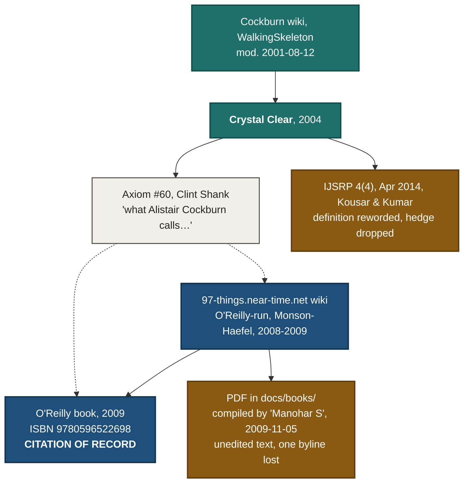

# 09 — Two supplementary sources in `docs/books/`: provenance before content

> **Renumbering note, 2026-08-01.** References to "lesson 0006" below mean the **vertical slice / tracer bullet / walking skeleton** lesson, which became **0008** when DIP took 0006 and YAGNI/DRY took 0007. Numbers updated in place; this note records why.


Two files the reader added to `docs/books/` on 2026-08-01. Neither is a book by
the standard the rest of `docs/books/` meets. This pass is about **provenance**;
content is secondary and, for one of the two, largely irrelevant.

Every claim carries a tier: **Quoted** · **Metadata verified** · **Chapter
located** · **`[unverified]`**.

Method note: both PDFs were opened locally with PyMuPDF (`fitz`) and their text
layers extracted in full. Every quoted sentence below was copied out of that
extraction character-for-character. External corroboration was fetched with
`curl` / WebFetch; where a fetch failed, the failure is recorded rather than
worked around.

---

## Part 1 — `Walking_Skeleton_Strategy_in_a_Test_Driv.pdf`

### Identification

**Metadata verified** (from the paper's own running header and title block,
plus the publisher's own listing).

| Field | Value | Evidence |
| --- | --- | --- |
| Title | *Walking Skeleton Strategy in a Test Driven Development* | Title block, p. 1 |
| Authors | **Hina Kousar**, **Kavitha Kumar** | Title block, p. 1 |
| Affiliation | *"MS Computer Science, Christ University"* | Title block, p. 1 (**Quoted**) |
| Venue | *International Journal of Scientific and Research Publications* (IJSRP) | Running header on all 6 pages (**Quoted**) |
| Volume / issue / date | **Volume 4, Issue 4, April 2014** | Running header (**Quoted**) |
| ISSN | **2250-3153** | Running header (**Quoted**) |
| Extent | 6 pages | `page_count` |
| DOI | **None — and this is confirmed, not assumed.** | See below |
| Publisher URL | <https://www.ijsrp.org/research-paper-0414/ijsrp-p2821.pdf> | Resolved via search; matches the running header's issue |

**On the DOI — a clean, quotable negative.** IJSRP's own home page states
(**Quoted**, <https://www.ijsrp.org/>):

> IJSRP is active member of Crossref and all published papers are issued DOI
> number since March 2018.

This paper is April 2014. **By the publisher's own statement it predates their
DOI registration, so no DOI exists.** Do not invent one, and do not read its
absence as evidence of fraud — it is exactly what the publisher says to expect.

**This particular copy is not the publisher's file.** The PDF metadata reads
`producer: GPL Ghostscript 9.10`, `creationDate: D:20150121033343-08'00'`,
empty title/author. A January 2015 Ghostscript re-render of an April 2014
paper, carried in a file named `Walking_Skeleton_Strategy_in_a_Test_Driv.pdf` —
the 40-character truncation pattern Academia.edu applies to download filenames.
**Our assessment, `[unverified]` as fact:** this is an Academia.edu download,
not the publisher's original. The paper *is* on Academia.edu
(<https://www.academia.edu/10259854/Walking_Skeleton_Strategy_in_a_Test_Driven_Development>)
and on Semantic Scholar. **Cite the publisher URL, never the local path.**

### Is it peer-reviewed, and where?

**Report what the journal says, then our assessment — separately.**

*What IJSRP says about itself* (**Quoted**, <https://www.ijsrp.org/>):

> peer-reviewed and refereed international journal

and

> SJ Impact Factor [2023]: 7.662

*What we could independently verify:*

- **DOAJ does not index ISSN 2250-3153.** DOAJ API query
  `https://doaj.org/api/search/journals/issn%3A2250-3153` returned
  `{"total": 0 … "results": []}` on 2026-08-01. **Quoted** (API response).
  DOAJ inclusion is the standard positive signal for a legitimate open-access
  journal; its absence is a real negative result.
- `https://www.ijsrp.org/publication-charges.html` and `/publication-fee.html`
  both returned **HTTP 404** to automated fetch. The APC amount was therefore
  **not obtained**. `[unverified]` — do not state a fee figure.
- "SJ Impact Factor" is not the Clarivate *Journal Impact Factor*. It is a
  differently-branded metric. Do not present 7.662 as a JIF.

**Our assessment (clearly ours, not a source's):** a low-selectivity
open-access venue. Not in DOAJ, self-advertised non-Clarivate impact factor.
**Treat this paper as a student-authored secondary source in a weakly-refereed
venue.** That is not the same as calling it fake — it is a real paper, in a real
issue, at a real ISSN. It is simply not evidence that outranks a primary source.

### What it says about the walking skeleton — and why it cannot outrank Cockburn

**The finding that matters: the paper's definition is Cockburn's definition with
the quotation marks removed.**

Paper, INTRODUCTION, p. 1 (**Quoted**):

> Walking Skeleton Strategy is a small implementation of the system or a slice
> of code that performs a small end-to-end function [1] that can be built,
> tested and deployed automatically. It may not use the final structure but it
> should link together the main architectural components. The functionality and
> the architecture can then evolve in parallel.

Cockburn, quoted from his own archived page in
[`06-walking-skeleton-and-harness-post.md`](./06-walking-skeleton-and-harness-post.md)
(**Quoted**):

> A Walking Skeleton is a tiny implementation of the system that performs a
> small end-to-end function. It need not use the final architecture, but it
> should link together the main architectural components. The architecture and
> the functionality can then evolve in parallel.

Sentence-for-sentence the same, with `tiny`→`small`, `architecture`→`structure`,
`need not`→`may not`, and the last clause's two nouns swapped. Reference `[1]`
is *"Alistair Cockburn, 'In Practice (Strategies & Techniques)' in Crystal Clear
… 2004"*, so it is cited — but presented as the authors' own prose, unquoted.
**The paper therefore cannot corroborate Cockburn independently. It *is*
Cockburn, relayed.**

The same is true of two more passages: the "what constitutes a walking skeleton
varies with the system" list (paper p. 5, TECHNIQUES section) and the
production-code/regression-test/Incremental Re-architecture contrast (paper
p. 2, section D) are both reworded from Cockburn's page.

**Second-order drift — a laundering example worth teaching.** Cockburn wrote a
*claim* about himself (**Quoted**): *"I first found this pattern or strategy
around 1994, named it somewhere between then and 1997."* The paper renders it as
a *fact* (p. 1, **Quoted**): *"This pattern or strategy was first found in 1994
by 'Alistair Cockburn'."* The hedge is gone and the 1994–1997 naming window has
collapsed to a single date. This is precisely the failure mode
`.claude/rules/research.md` calls **no smoothing**, caught in the wild, and it
is directly usable in a lesson.

### Tracer bullet, vertical slice, spanning application — mechanically checked absence

A literal token count over the full 6-page text layer:

| Token | Occurrences |
| --- | --- |
| `tracer` / `Tracer` | **0** |
| `vertical` / `Vertical` | **0** |
| `spanning` / `Spanning` | **0** |
| `Poppendieck` | **0** |
| `spike` / `Spike` | **0** |
| `Hunt` · `Thomas` · `Pragmatic` | **0** each |
| `slice` | 1 — only in *"or a slice of code"* above |

**Verdict on the relationship question: the paper is silent.** It neither
corroborates nor contradicts Cockburn's *"Other authors have other names for
similar sorts of ideas…"* sentence, because it never mentions any of the
neighbours. **`06` remains the sole source on the walking-skeleton / tracer-bullet
/ vertical-slice relationship.** Nothing here disturbs it.

Notably it also drops Cockburn's **spike** contrast — the one boundary he drew
most sharply — while keeping the "permanent code, production coding habits,
regression tests" half of it. The distinction survives without the thing it was
distinguished *from*.

### Empirical content: none

**A negative result, reported plainly.** The abstract claims (**Quoted**):

> this paper will help us understand how the implementation of Walking Skeleton
> Strategy is time and cost effective

**No study, experiment, case study, survey, measurement or number supports it.**
Token counts over the full text: `%` → **0**, `study` → **0**, `experiment` →
**0**, `case study` → **0**, `survey` → **0**. There is no results section, no
subject count, no before/after comparison. The conclusion restates the claim
(**Quoted**): *"It is time efficient and cost effective as the whole process of
building a software system is being automated."*

**So this paper adds no empirical evidence to the course.** Any "walking
skeletons save time and money" claim citing it would be citing an assertion, not
a measurement.

### A substantive misreading of the source it cites

**Our assessment, flagged as ours.** The paper's section headed
**"TECHNIQUES TO CREATE WALKING SKELETON"** (p. 5) introduces its list with
*"Following are the techniques which can be used to create a walking skeleton"*
(**Quoted**) and then lists: **Methodology Shaping · Reflection Workshop ·
Blitz Planning · Delphi Estimation · Daily Stand-ups · Agile Interaction Design ·
Process Miniature · Side-by-Side Programming · Burn Charts.**

Those are *Crystal Clear*'s **methodology practices** — Cockburn's team-process
techniques for running a project — not techniques for building a walking
skeleton. `Blitz Planning` is release planning; `Delphi Estimation` is
estimation; `Reflection Workshop` is a retrospective format. **None of them
produces an end-to-end connected system.** The section has taken the list of
techniques that appears *alongside* the walking skeleton in its cited source and
re-labelled it as a list of techniques *for* the walking skeleton.

**This is worse than rewording.** It is a misreading of the one primary source
the paper depends on, and it is the strongest single reason not to cite this
paper for anything about how a walking skeleton is built.

### Two citation defects in its own reference list

Recorded because they are cheap corroboration of the low-rigour assessment, and
because the same errors circulate elsewhere:

- Ref `[2]`: *"Martin Fowler, 'Improving the Design of Existing Code'
  Addison-Wesley Professional publications, June 28th 1999"* — that string is
  *Refactoring*'s **subtitle**, used as the title. Also cited in support of a
  TDD sentence, which is not that book's subject.
- Ref `[13]`: *"Jez Humble; David Farley, 'Reliable Software Releases through
  Build, Test, and Deployment Automation'"* — again the **subtitle**; the title
  is *Continuous Delivery*.

Both **Quoted** from the paper's reference list, p. 5–6.

### Verdict

**Usable, but only as an example — never as authority.** It is a real,
citable-in-principle paper in a weak venue whose entire walking-skeleton content
is Cockburn reworded. Its value to this course is *as a specimen* of secondary
laundering (hedge → fact), not as a source of the concept.

---

## Part 2 — `97-things-every-software-architect-should-know.pdf`

The brief for this file expected a scraped or retyped copy of the O'Reilly book.
**The evidence points somewhere else, and the honest verdict is more favourable
than that.** Under-claiming a source's legitimacy is the same smoothing failure
as over-claiming it, so this section reports what the file says about itself
first and judges after.

### The file's own front matter

**Quoted**, page 1 of the PDF, verbatim:

> 97 Things Every Software Architect Should Know - The Book
>
> http://97-things.near-time.net/wiki/97-things-every-software-architect-should-know-the-book
>
> The following are the original, unedited contributions for the book 97 Things
> Every Software Architect Should Know, which is available at O'Reilly Media ,
> Amazon.com and your local book stores.
>
> This work is licensed under a Creative Commons Attribution 3

Page 2 carries a revision-history table (**Quoted**):
`Ver. 1.0` · `Date 2009.11.05` · `Author Manohar S` ·
`Comment: Compiled from links on http://97-things.near-time.net/wiki/97-things-every-software-architect-should-know-the-book`

PDF metadata corroborates: `author: Manohar`, `creator`/`producer:
Microsoft® Office Word 2007`, `creationDate: D:20091105063805` — the same date
the revision table states. **Empty title, no TOC bookmarks, no O'Reilly
typesetting.**

### The source wiki is real and archive-backed

**Quoted.** Wayback capture **2009-10-26 15:43:41 UTC** (`20091026154341`) of
`97-things.near-time.net/wiki/97-things-every-software-architect-should-know-the-book`:
<https://web.archive.org/web/20091026154341/http://97-things.near-time.net/wiki/97-things-every-software-architect-should-know-the-book>

The archived page is authored **"by Richard Monson-Haefel"** and its body opens
with the identical sentence the PDF reproduces:

> The following are the original, unedited contributions for the book 97 Things
> Every Software Architect Should Know , which is available at O'Reilly Media ,
> Amazon.com and your local book stores.

It then lists the axioms **in the same order as the PDF's table of contents,
each with the same byline** — `Don't put your resume ahead of the requirements
by Nitin Borwankar`, `Simplify essential complexity; diminish accidental
complexity by Neal Ford`, `Chances are your biggest problem isn't technical by
Mark Ramm`, and so on. **The PDF's provenance chain is therefore established,
not merely claimed.**

The site's own `rules-of-engagement` page (**Quoted**, Wayback capture
**2009-03-14 02:54:41 UTC**,
<https://web.archive.org/web/20090314025441/http://97-things.near-time.net/wiki/rules-of-engagement>)
confirms O'Reilly ran it:

> Rude or offensive language is not welcome and violations will be removed at
> the pleasure of O'Reilly Media, Inc.

> After a contribution is reviewed by O'Reilly (usally Richard Monson-Haefel) it
> will be be annotated with a designation and comment.

*(That reproduces the page's typos `usally` and `be be` verbatim.)*

**So this is not a scrape of the book.** It is a compilation of the **pre-edit
wiki submissions** that O'Reilly solicited publicly — i.e. it *is* the
"freely-licensed original" the brief sent us hunting for, in one PDF.

### The licence claim, however, is the compiler's — not verified

**`[unverified]`.** The PDF asserts *"This work is licensed under a Creative
Commons Attribution 3"* — truncated, with no version suffix, no deed URL, no
badge. **No Creative Commons statement was found on either archived
near-time.net page reached** (the index capture of 2009-10-26 and
`rules-of-engagement` of 2009-03-14 were both searched for `creative commons` /
`creativecommons` in raw HTML: zero hits).

A third-party mirror, `yoshi389111.github.io/kinokobooks/soft_en/`, repeats the
same truncated licence line and the same bylines — but it is a mirror, plausibly
derived from this very compilation, so it is **not independent corroboration**.

**Record it as: the compiler asserts CC-BY-3.0; we could not confirm that
licence on the source site.**

### Completeness and attribution — measured, not eyeballed

Measured by splitting the extracted body at each of the 97 TOC titles in order
and inspecting each slice:

| Question | Answer | Method |
| --- | --- | --- |
| Items in TOC | **97**, numbered 1–97 | Regex over the TOC pages |
| Items whose text is present in the body | **97 of 97**, none missing | Ordered title match, zero unlocated |
| Items carrying a named attribution | **96 of 97** | Byline scan per slice |
| The exception | **#47 "Welcome to the Real World"** — no byline anywhere in its section | Full-slice scan |

**The one lost attribution is confirmed lost, not merely absent** — the archived
wiki index lists it (**Quoted**, capture `20091026154341`):

> Welcome to the real world by Gregor Hohpe

So the source page credited **Gregor Hohpe**, and the compiler dropped the
byline while keeping the text. (Corroborating detail: the axiom's own footnote
in the PDF points at `http://www.eaipatterns.com/ramblings/18_starbucks.html` —
Hohpe's site.) **One attribution in 97 was lost in compilation. That is the
concrete defect, and it is small.**

Attribution formats vary because the compiler pasted whatever the wiki page
carried: mostly `By Clint Shank`, but also `By: Evan Cofsky`, a bare
`Bill de hÓra`, a parenthetical `(Niclas Nilsson Edited 29/9/2008)`, and for
#19 a raw wiki-user URL —
`By http://commons.oreilly.com/wiki/index.php/User:JtdaviesJohn Davies`
(**Quoted**), which incidentally shows a second O'Reilly-hosted wiki in the
chain. **The named-architect attribution the real book's value rests on is
substantially preserved**, contrary to the brief's expectation.

### What it does *not* carry

- **No ISBN.** Token count for `isbn` across all 119 pages: **0**.
- **No copyright page.** Token count for `copyright`: **0**.
- **No O'Reilly front matter, no editor credit for Monson-Haefel as editor.**
  `O'Reilly` appears **once** (in the sentence quoted above);
  `Monson` appears **once**, and it is as the *contributing author* byline of an
  axiom, not as the book's editor.
- No preface, no index, no publisher pagination.

### The official edition, for the citation of record

**Metadata verified — with its source named.** OpenLibrary
(<https://openlibrary.org/search.json?q=97+Things+Every+Software+Architect+Should+Know>,
fetched 2026-08-01) returns exactly one work:
title *97 things every software architect should know*, author
**Richard Monson-Haefel**, first published **2009**, publishers
*O'Reilly* / *O'Reilly Media*, median page count 200. ISBNs listed include
**`9780596522698` / `059652269X`** (print) and **`9780596800611` / `0596800614`**
(the identifier O'Reilly's own learning-platform URL uses, i.e. the ebook).

**Caveat, stated rather than hidden:** OpenLibrary is a **catalogue**, not the
publisher. `https://www.oreilly.com/library/view/97-things-every/9780596800611/`
returned **HTTP 403** to automated fetch, so the publisher page itself was
**not** read. Say which ISBN and which format when citing, and prefer confirming
against the physical copy if the reader acquires one.

### Content spot-check — and one directly useful find

Axiom **#60, "Start with a Walking Skeleton", by Clint Shank** (**Quoted** from
the PDF, **PDF page 80** — this file has no printed pagination, so that is the
sheet number, not a book page):

> One very useful strategy for implementing, verifying, and evolving an
> application architecture is to start with what Alistair Cockburn calls a
> Walking Skeleton . A Walking Skeleton is a minimal, end-to-end implementation
> of the system that links together all the main architectural components.
> Starting small, with a working system exercising all the communication paths,
> gives you confidence that you are heading in the right direction.

The same text, with the same byline, appears on the third-party mirror
<https://yoshi389111.github.io/kinokobooks/soft_en/Start_with_a_Walking_Skeleton.htm>.

**Two things follow, and they cut in the same direction as Part 1.** Shank
attributes the term explicitly to Cockburn — *"what Alistair Cockburn calls a
Walking Skeleton"* — and, like the IJSRP paper, says nothing about tracer
bullets, spanning applications or vertical slices.

**State the asymmetry precisely.** Shank is a genuine **second voice** — an
editorially-reviewed 2009 contribution that independently routes the term back
to Cockburn. Kousar & Kumar is **not** independent; it is Cockburn reworded, as
Part 1 shows. What is true of *both* is the thing that matters here: **both are
silent on tracer bullets, spanning applications and vertical slices.** So
neither adds to nor contradicts Cockburn's own naming of the neighbours, and
`06` stands unchallenged as the sole source on that relationship.

### Provenance chain



**What to notice.** The two amber nodes are the two files in `docs/books/`, and
neither sits on the path to a citation of record. The PDF is a sibling of the
book, drawn from the same wiki but from the *unedited* text — so quoting it and
crediting the O'Reilly edition attributes words to a page that never printed
them. The IJSRP paper hangs off *Crystal Clear*, not off any independent
observation.

### Citability verdict

**It may be used to *find* an axiom. It may not be the citation of record. Two
distinct reasons, and both must be stated — they are different failure modes:**

1. **It is the *unedited* text.** By its own front matter these are *"the
   original, unedited contributions"* — the submissions **before** O'Reilly's
   editing. Quoting a sentence from this PDF and attributing it to the O'Reilly
   book would attribute words to a printed page that does not contain them, even
   though the compilation itself is plausibly legal. **This is an inference from
   the file's own description, stated as one:** text described as *unedited* is
   by construction not the edited text that was printed. **The *degree* of
   difference is unmeasured** — the O'Reilly page returned 403 and no copy of
   the print edition was read, so no claim is made about how far the two
   diverge. What *is* measured is narrower and enough on its own: the
   compilation is not even a faithful copy of the wiki index it names as its
   source. Item #15 is `Commit-and-run is a serious crime. Respect your
   Colleagues` on the archived wiki and `Commit-and-run is a crime.` in this
   file's TOC, and #47's byline was dropped outright. Drift is already visible
   at the first hop.
2. **Its licence is asserted, not verified,** and it carries no ISBN, no
   copyright page and no publisher imprint. It fails the **Metadata verified**
   bar on its own.

**Therefore:**

- **Citation of record for any axiom → the O'Reilly edition** (Monson-Haefel,
  ed., O'Reilly Media, 2009, ISBN `9780596522698` print / `9780596800611`
  ebook — source: OpenLibrary; publisher page 403'd).
- **Free, archive-backed alternative when the book is not to hand → the Wayback
  capture of the O'Reilly-run wiki**, `20091026154341`, cited *as the wiki
  contribution* with its author and date — never as the book.
- **This PDF → a finding aid only.** Never a quote source, never the citation.

### Recommended `RESOURCES.md` wording

To be added under **`## Knowledge — software engineering`**, matching the
existing entry shape (bold title line, publisher/year/ISBN, a *Use for:* line,
caveats in bold). **Recommendation only — this pass does not edit the file.**

```markdown
- **Richard Monson-Haefel (ed.), _97 Things Every Software Architect Should Know_** — O'Reilly Media, **2009**, ISBN `9780596522698` (print) / `9780596800611` (ebook)
  97 one-page axioms, each signed by a named architect. Use for: **#60 "Start with a Walking Skeleton" (Clint Shank)**, which attributes the term to Cockburn in a second, independent voice — good corroboration for lesson 0008.
  **ISBN source is OpenLibrary, a catalogue — the O'Reilly page returns 403 to automated fetch.** Name the format when citing.
  **The copy in `docs/books/` is NOT this edition and must never be the citation.** It is a 119-page Word-2007 PDF compiled 2009-11-05 by "Manohar S" from the O'Reilly-run wiki `97-things.near-time.net`, containing by its own front matter *"the original, unedited contributions for the book"* — the pre-edit submissions, not the printed text. It is complete (97 of 97 items) and 96 of 97 keep their author byline — the one lost is #47 "Welcome to the Real World", which the wiki credits to Gregor Hohpe — so it is a fine **finding aid**; it carries no ISBN, no copyright page, and its *"Creative Commons Attribution 3"* line is the compiler's claim, **unconfirmed** on any archived source page. Quote from the book, or from the archived wiki page ([capture 2009-10-26](https://web.archive.org/web/20091026154341/http://97-things.near-time.net/wiki/97-things-every-software-architect-should-know-the-book)) cited *as a wiki contribution*. See `docs/research/09-supplementary-sources.md`.
- **Kousar, H. & Kumar, K., "Walking Skeleton Strategy in a Test Driven Development"** — *International Journal of Scientific and Research Publications* **4(4), April 2014**, ISSN `2250-3153`, 6 pp., **no DOI** (IJSRP states it has issued DOIs only *"since March 2018"*). <https://www.ijsrp.org/research-paper-0414/ijsrp-p2821.pdf>
  **Do not cite this for the walking skeleton.** Its definition is Cockburn's, reworded and unquoted, and it contains **no study, no measurement and no case** despite claiming the strategy is "time and cost effective". IJSRP is **not indexed in DOAJ**; its advertised "SJ Impact Factor 7.662" is not a Clarivate JIF.
  It also mislabels *Crystal Clear*'s methodology practices (Blitz Planning, Delphi Estimation, Reflection Workshop…) as *"techniques which can be used to create a walking skeleton"*.
  **Use for one thing only:** as a worked specimen of secondary-source drift — Cockburn's *"I first found this pattern or strategy around 1994"* becomes the paper's *"This pattern or strategy was first found in 1994 by 'Alistair Cockburn'."* The hedge disappears. See `docs/research/09-supplementary-sources.md`.
```

Also recommended, under **`## Source hazards found during research`**:

```markdown
- **A PDF in `docs/books/` is not automatically a book.** Check `producer` / `author` / `creationDate` in the PDF metadata **before** quoting: `Microsoft® Office Word 2007` or `GPL Ghostscript` where a publisher's typesetter should be is the tell. (Measured 2026-08-01: `97-things…pdf` → Word 2007, author `Manohar`, no ISBN anywhere; `Walking_Skeleton…pdf` → Ghostscript 9.10, empty author. The other three are e-book conversions — calibre / PDFKit.NET / PStill — which is a different and more benign signature; note that `DDD - Eric Evans.pdf` also has **no ISBN string** in its front matter, so "no ISBN" alone is not the discriminator. The publisher imprint is.) `oreilly.com/library/view/*` returns **403** to automated fetch; OpenLibrary's search API answers, but it is a catalogue, not the publisher.
```

---

## What this pass changes, and what it does not

**Does not change:** `06`'s account of the walking skeleton, tracer bullet and
vertical slice. Both new sources are downstream of Cockburn, both silent on
tracer bullets and vertical slices, and neither contradicts him. The
`vertical slice` coiner gap in `RESOURCES.md` `## Gaps` stays open.

**Adds, and it is worth having:**

- **A second named voice attributing the walking skeleton to Cockburn** —
  Clint Shank, in a professionally-edited 2009 O'Reilly book. Useful in lesson
  0006 precisely because it is *not* Cockburn talking about himself.
- **A worked example of evidence drift** (hedge → fact) that the course can
  teach from, since the reader's stated goal includes arguing from evidence in
  front of skeptics.
- **A negative empirical result, reported as such:** the one academic paper on
  hand about walking skeletons contains no data. The course should not pretend
  otherwise.

## Sources tried and their outcome

| Route | Outcome |
| --- | --- |
| PyMuPDF text extraction, both PDFs | **Worked.** Full text layers present in both. |
| `oreilly.com/library/view/97-things-every/9780596800611/` | **HTTP 403.** Publisher metadata not read directly. |
| `openlibrary.org/search.json` | **Worked.** Author, year, publishers, ISBN list. Catalogue-tier. |
| Wayback CDX + capture, `97-things.near-time.net` (exact URL) | **Worked** after rate-limit backoff. Two captures read; provenance confirmed. Prefix/wildcard CDX queries **time out** on this dead host — query the exact URL. |
| Search for `creative commons` on both archived wiki pages | **Zero hits.** Licence claim stays `[unverified]`. |
| `doaj.org/api/search/journals/issn:2250-3153` | **Worked.** `total: 0` — not indexed. |
| `ijsrp.org` home page | **Worked.** Peer-review claim, DOI-since-2018 statement, impact-factor claim all quoted. |
| `ijsrp.org/publication-charges.html`, `/publication-fee.html` | **HTTP 404** both. APC amount not obtained; no figure stated. |
| `semanticscholar.org` paper page (WebFetch) and Graph API | Page fetch returned empty; API returned **HTTP 429**. Nothing taken from either. |
| `yoshi389111.github.io` mirror | Read, but treated as a **derived mirror**, not independent corroboration. |
